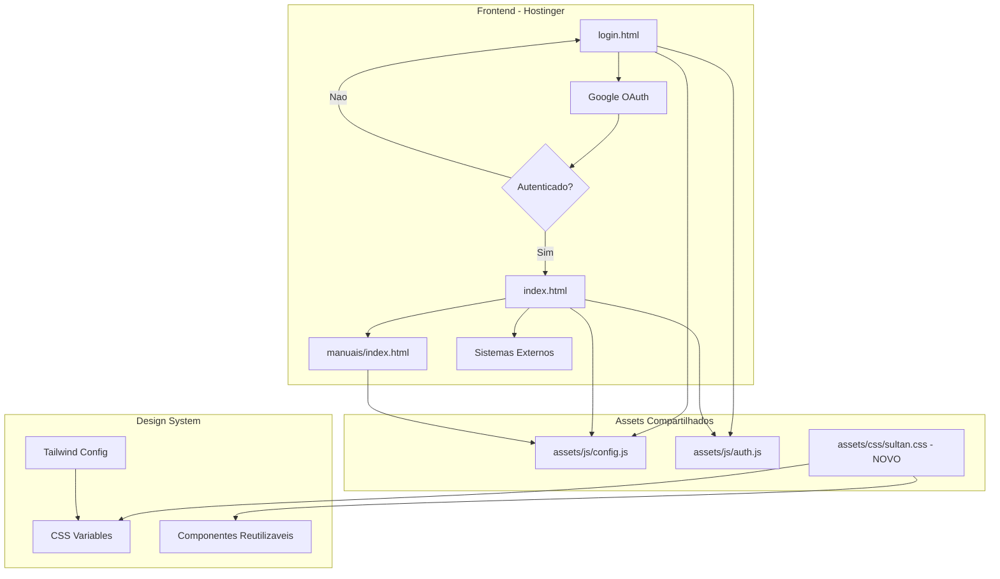
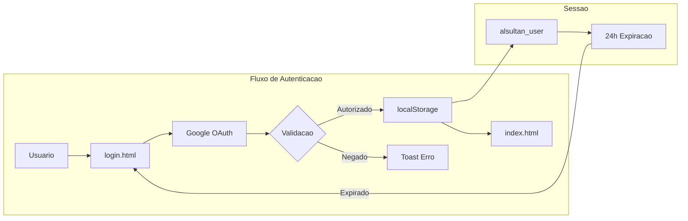
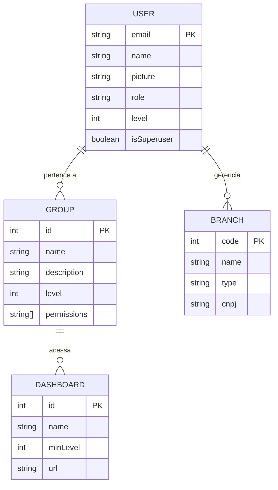
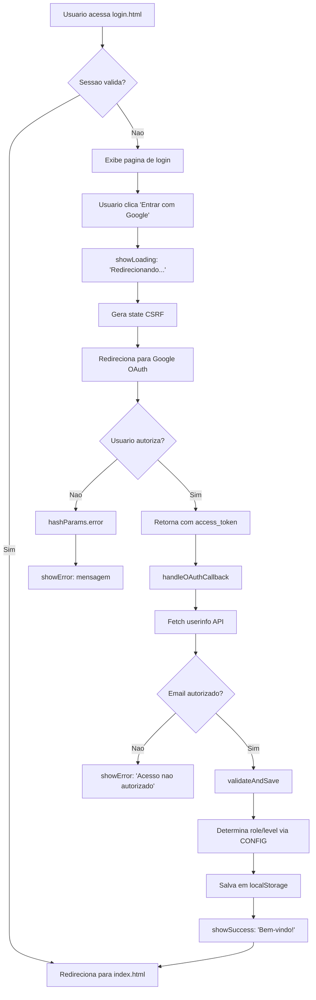
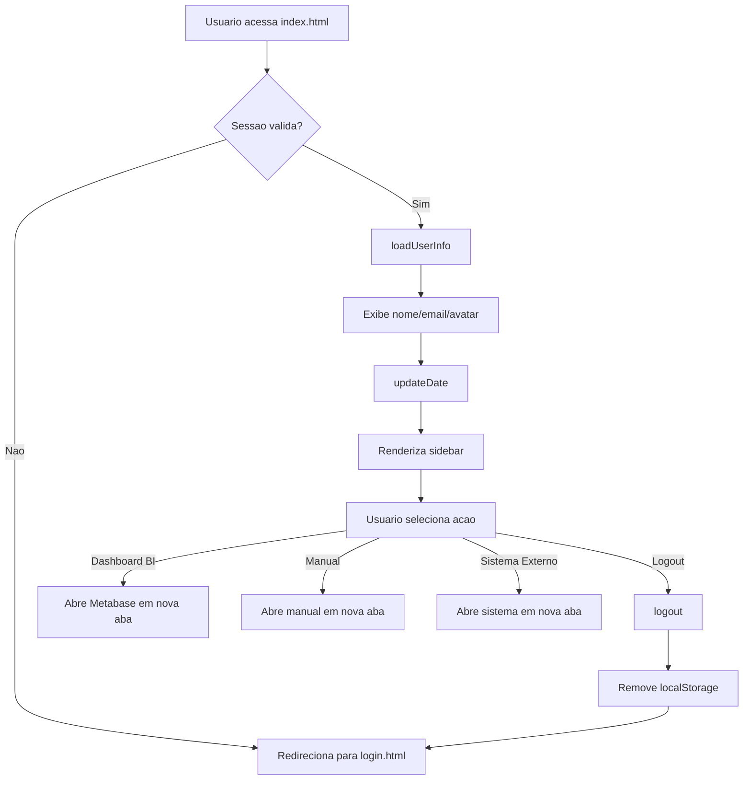
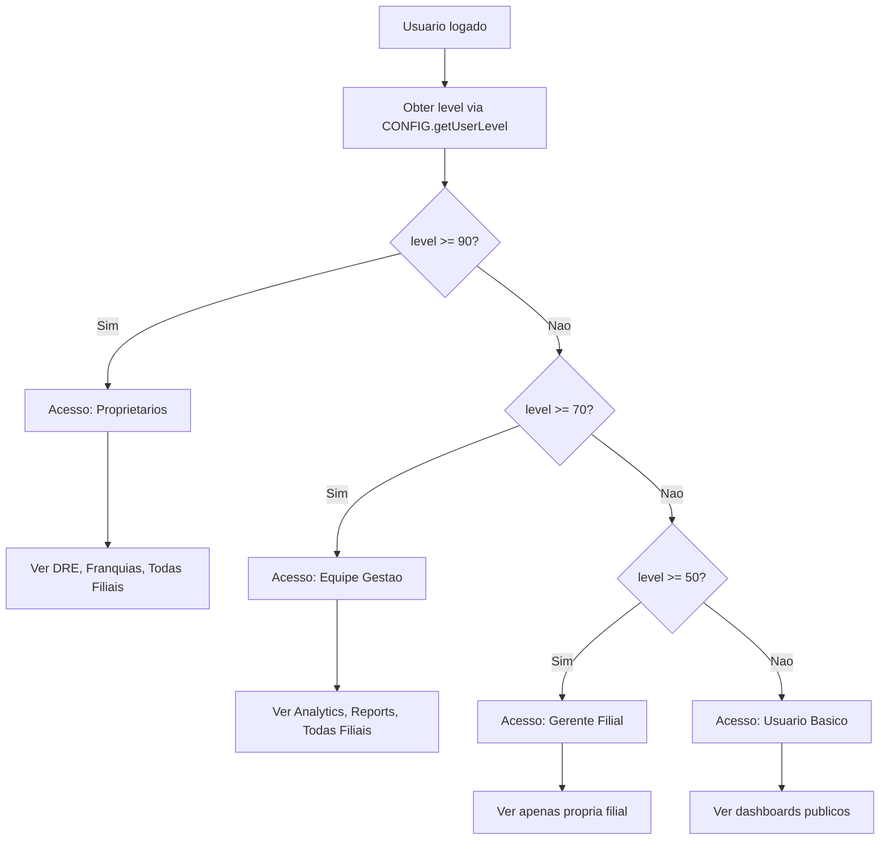
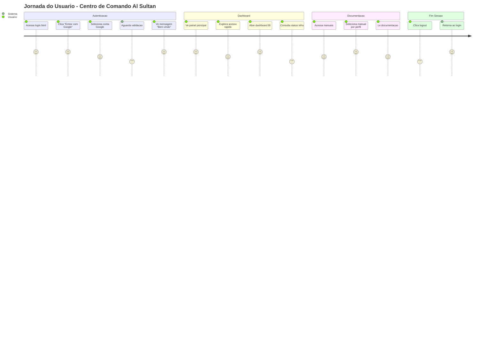
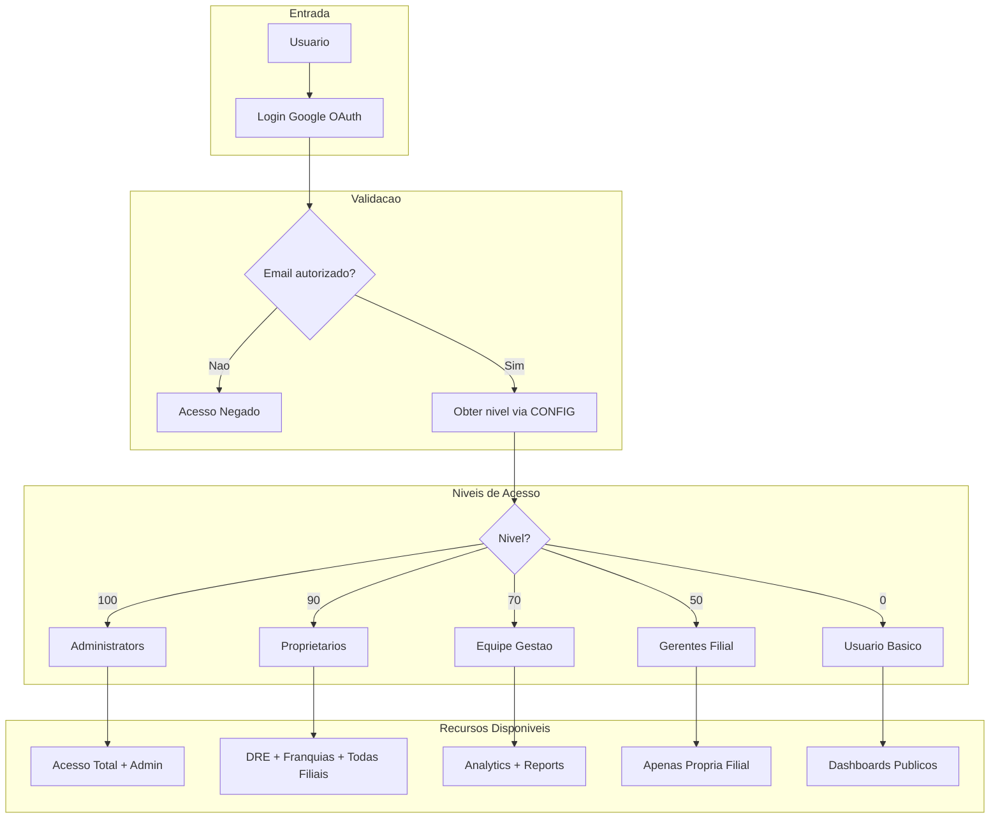
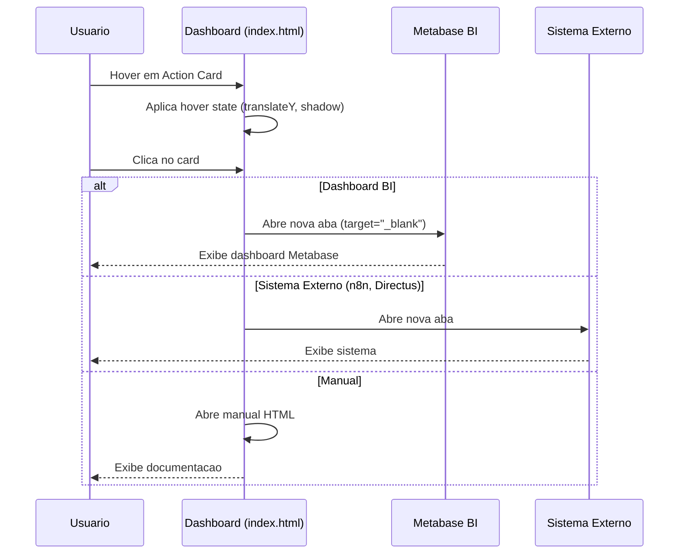

# Al Sultan - Centro de Comando
## Design Document - Melhorias UX/Visual v1.0

**Data**: 2026-01-09
**Versao**: 1.0
**Autor**: Design System Team
**Status**: Draft

---

## 1. Overview

### 1.1 Objetivo

Este documento define as melhorias de UX/Visual para o Centro de Comando Al Sultan, garantindo consistencia visual entre todas as paginas e alinhamento com a identidade da marca Al Sultan.

### 1.2 Escopo

| Pagina | Status Atual | Prioridade |
|--------|-------------|------------|
| `login.html` | Redesenhado (novo) | Concluido |
| `index.html` | Dashboard funcional | Alta |
| `manuais/index.html` | Funcional | Media |

### 1.3 Problema Identificado

**Inconsistencia Visual Critica**:

1. **login.html** usa paleta QUENTE (laranja/dourado/areia) - alinhada com marca Al Sultan
2. **index.html** usa paleta FRIA (verde escuro/dourado) - desalinhada

```
LOGIN (Correto)                    INDEX (Problema)
+------------------+               +------------------+
| Laranja #ea5512  |               | Verde #0a1a0a    |
| Dourado #ffca07  |               | Verde #0d2d0d    |
| Areia #faf6f0    |               | Dourado #d4af37  |
| Creme #fff8f0    |               | Creme #faf8f5    |
+------------------+               +------------------+
```

### 1.4 Solucao Proposta

Unificar todas as paginas com a paleta QUENTE do `login.html`, que reflete a identidade visual oficial do Al Sultan (cores da marca no site alsultan.com.br).

---

## 2. Architecture Design

### 2.1 System Architecture Diagram



### 2.2 Data Flow Diagram



---

## 3. Components and Interfaces

### 3.1 Component A: Design System CSS

**Responsabilidades**:
- Centralizar variaveis CSS da marca
- Definir componentes reutilizaveis
- Garantir consistencia visual

**Interfaces**:
```css
/* Importacao em qualquer pagina */
<link rel="stylesheet" href="assets/css/sultan.css">

/* Ou inline via <style> com variaveis */
:root {
    --sultan-orange: #ea5512;
    --sultan-gold: #ffca07;
    ...
}
```

**Dependencies**:
- Google Fonts (Playfair Display, Poppins)
- FontAwesome 6.4.0
- Tailwind CSS (opcional, para index.html)

### 3.2 Component B: Card Components

**Tipos de Card**:

| Tipo | Uso | Classe CSS |
|------|-----|------------|
| Glass Card | Containers com blur | `.glass-card` |
| Action Card | Links clicaveis | `.action-card` |
| Info Card | Informacoes estaticas | `.info-card` |
| Feature Card | Destaques | `.feature-card` |

### 3.3 Component C: Button Components

| Variante | Uso | Classe CSS |
|----------|-----|------------|
| Primary | CTA principal | `.btn-primary` |
| Secondary | Acoes secundarias | `.btn-secondary` |
| Quick Action | Acesso rapido | `.quick-btn` |
| Ghost | Links discretos | `.btn-ghost` |

---

## 4. Data Models

### 4.1 Core Data Structure Definitions

```typescript
// Usuario autenticado (localStorage)
interface AlSultanUser {
    name: string;
    email: string;
    picture: string | null;
    loginTime: string; // ISO 8601
    role: 'administrators' | 'proprietarios' | 'equipeGestao' | 'filial' | 'user';
    groupIds: number[];
    groupName: string;
    level: number; // 0-100
    isSuperuser: boolean;
    canAccessAdmin: boolean;
    isDemo?: boolean;
}

// Configuracao de hierarquia
interface GroupConfig {
    id: number;
    name: string;
    description: string;
    level: number;
    branchCode?: number;
    permissions: string[];
}

// Configuracao de dashboard
interface DashboardConfig {
    id: number;
    name: string;
    minLevel: number;
}
```

### 4.2 Data Model Diagrams



---

## 5. Business Process

### 5.1 Process 1: Fluxo de Login



### 5.2 Process 2: Navegacao no Dashboard



### 5.3 Process 3: Controle de Acesso por Nivel



---

## 6. Error Handling Strategy

### 6.1 Categorias de Erro

| Categoria | Exemplo | Tratamento |
|-----------|---------|------------|
| Autenticacao | Token expirado | Redireciona para login |
| Autorizacao | Email nao permitido | Toast de erro + permanece na pagina |
| Rede | Falha OAuth | Toast de erro com retry |
| Sessao | localStorage corrompido | Limpa sessao + redireciona |

### 6.2 Componentes de Feedback

```html
<!-- Toast de Erro -->
<div id="error-toast" class="toast error">
    <i class="fas fa-exclamation-circle"></i>
    <span id="error-message">Erro ao autenticar</span>
</div>

<!-- Toast de Sucesso -->
<div id="success-toast" class="toast success">
    <i class="fas fa-check-circle"></i>
    <span id="success-message">Login realizado com sucesso!</span>
</div>

<!-- Loading Overlay -->
<div id="loading-overlay" class="loading-overlay">
    <div class="loader"></div>
    <p class="loading-text" id="loading-text">Autenticando...</p>
</div>
```

### 6.3 Funcoes de Tratamento

```javascript
function showError(message) {
    showLoading(false);
    const toast = document.getElementById('error-toast');
    document.getElementById('error-message').textContent = message;
    toast.classList.add('show');
    setTimeout(() => toast.classList.remove('show'), 5000);
}

function showSuccess(message) {
    const toast = document.getElementById('success-toast');
    document.getElementById('success-message').textContent = message;
    toast.classList.add('show');
    setTimeout(() => toast.classList.remove('show'), 3000);
}
```

---

## 7. Testing Strategy

### 7.1 Testes Manuais de UX

| Cenario | Passos | Resultado Esperado |
|---------|--------|-------------------|
| Login com email autorizado | 1. Acessar login.html 2. Clicar Google 3. Selecionar conta | Redireciona para index.html |
| Login com email nao autorizado | 1. Acessar login.html 2. Clicar Google 3. Selecionar conta externa | Toast "Acesso nao autorizado" |
| Sessao expirada | 1. Logar 2. Esperar 24h 3. Acessar index.html | Redireciona para login.html |
| Logout | 1. Acessar index.html 2. Clicar botao sair | Redireciona para login.html |

### 7.2 Testes de Consistencia Visual

| Teste | Paginas | Verificacao |
|-------|---------|-------------|
| Paleta de cores | login, index, manuais | Todas usam mesmas variaveis CSS |
| Tipografia | login, index, manuais | Playfair Display + Poppins/Inter |
| Espacamento | Todos os cards | Padding e margin consistentes |
| Responsividade | Todas | Breakpoints 640px, 1024px |

### 7.3 Matriz de Compatibilidade

| Browser | Versao | Status | Notas |
|---------|--------|--------|-------|
| Chrome | 90+ | Suportado | Principal |
| Firefox | 88+ | Suportado | |
| Safari | 14+ | Suportado | |
| Edge | 90+ | Suportado | |
| Mobile Chrome | Android 10+ | Suportado | |
| Mobile Safari | iOS 14+ | Suportado | |

---

## 8. Style Guide

### 8.1 Paleta de Cores - Al Sultan Brand

```css
:root {
    /* ===== CORES PRIMARIAS (Brand Al Sultan) ===== */
    --sultan-orange: #ea5512;          /* Laranja principal */
    --sultan-orange-dark: #c94510;     /* Laranja escuro (hover) */
    --sultan-orange-light: #ff6b2c;    /* Laranja claro */
    --sultan-gold: #ffca07;            /* Dourado destaque */
    --sultan-gold-light: #ffe066;      /* Dourado claro */
    --sultan-red: #e5123c;             /* Vermelho alerta */
    --sultan-teal: #0bb0a0;            /* Verde-azulado sucesso */

    /* ===== CORES NEUTRAS ===== */
    --sand-light: #faf6f0;             /* Fundo principal */
    --sand: #f5ebe0;                   /* Fundo secundario */
    --sand-dark: #e6d5c3;              /* Bordas */
    --cream: #fff8f0;                  /* Fundo cards */
    --brown-dark: #2d1810;             /* Texto principal */
    --brown-medium: #5c3d2e;           /* Texto secundario */

    /* ===== GRADIENTES ===== */
    --gradient-warm: linear-gradient(135deg, #ea5512 0%, #ffca07 100%);
    --gradient-sunset: linear-gradient(135deg, #ff6b2c 0%, #ea5512 50%, #c94510 100%);
    --gradient-sand: linear-gradient(180deg, #faf6f0 0%, #f5ebe0 100%);
}
```

### 8.2 Tipografia

```css
/* Fonte Display - Titulos */
font-family: 'Playfair Display', serif;
/* Pesos: 400, 500, 600, 700, 800 */

/* Fonte Sans - Corpo */
font-family: 'Poppins', sans-serif;
/* Pesos: 300, 400, 500, 600, 700 */

/* Alternativa (index.html atual) */
font-family: 'Inter', sans-serif;
```

### 8.3 Hierarquia Tipografica

| Elemento | Fonte | Tamanho | Peso | Cor |
|----------|-------|---------|------|-----|
| H1 (Brand) | Playfair Display | 4rem | 800 | white |
| H2 (Page Title) | Playfair Display | 2.2rem | 700 | --brown-dark |
| H3 (Section) | Playfair Display | 1.5rem | 600 | --brown-dark |
| Body | Poppins | 1rem | 400 | --brown-dark |
| Caption | Poppins | 0.85rem | 400 | --brown-medium |
| Label | Poppins | 0.8rem | 500 | --brown-medium |

### 8.4 Espacamento

```css
/* Sistema de espacamento (8px base) */
--space-1: 0.25rem;   /* 4px */
--space-2: 0.5rem;    /* 8px */
--space-3: 0.75rem;   /* 12px */
--space-4: 1rem;      /* 16px */
--space-5: 1.25rem;   /* 20px */
--space-6: 1.5rem;    /* 24px */
--space-8: 2rem;      /* 32px */
--space-10: 2.5rem;   /* 40px */
--space-12: 3rem;     /* 48px */
```

### 8.5 Border Radius

```css
--radius-sm: 10px;    /* Botoes pequenos */
--radius-md: 16px;    /* Cards, inputs */
--radius-lg: 20px;    /* Cards grandes */
--radius-xl: 30px;    /* Elementos destaque */
--radius-full: 50px;  /* Pills, badges */
--radius-circle: 50%; /* Avatares */
```

### 8.6 Sombras

```css
/* Elevacao baixa - Cards em repouso */
--shadow-sm: 0 4px 15px rgba(0, 0, 0, 0.05);

/* Elevacao media - Cards hover */
--shadow-md: 0 8px 30px rgba(234, 85, 18, 0.15);

/* Elevacao alta - Modais, overlays */
--shadow-lg: 0 20px 60px rgba(0, 0, 0, 0.2);

/* Sombra de texto (titulos sobre imagem) */
--text-shadow: 0 4px 20px rgba(0, 0, 0, 0.3);
```

---

## 9. Component Library

### 9.1 Glass Card (index.html)

```css
.glass-card {
    background: rgba(234, 85, 18, 0.05);
    backdrop-filter: blur(16px);
    border: 1px solid rgba(234, 85, 18, 0.15);
    border-radius: var(--radius-lg);
    transition: all 0.3s ease;
}

.glass-card:hover {
    background: rgba(234, 85, 18, 0.1);
    border-color: rgba(234, 85, 18, 0.3);
}
```

### 9.2 Action Card

```css
.action-card {
    background: linear-gradient(135deg, rgba(250, 246, 240, 0.9) 0%, rgba(255, 248, 240, 0.95) 100%);
    border: 1px solid var(--sand-dark);
    border-radius: var(--radius-lg);
    padding: var(--space-6);
    transition: all 0.3s ease;
}

.action-card:hover {
    border-color: var(--sultan-orange);
    transform: translateY(-3px);
    box-shadow: var(--shadow-md);
}
```

### 9.3 Button Primary

```css
.btn-primary {
    display: inline-flex;
    align-items: center;
    justify-content: center;
    gap: var(--space-3);
    padding: var(--space-4) var(--space-8);
    background: var(--gradient-warm);
    border: none;
    border-radius: var(--radius-md);
    font-family: 'Poppins', sans-serif;
    font-size: 1rem;
    font-weight: 600;
    color: white;
    cursor: pointer;
    transition: all 0.3s cubic-bezier(0.4, 0, 0.2, 1);
    box-shadow: 0 4px 15px rgba(234, 85, 18, 0.3);
}

.btn-primary:hover {
    transform: translateY(-3px);
    box-shadow: 0 8px 25px rgba(234, 85, 18, 0.4);
}
```

### 9.4 Quick Button

```css
.quick-btn {
    display: inline-flex;
    align-items: center;
    gap: var(--space-2);
    padding: var(--space-2) var(--space-4);
    background: rgba(234, 85, 18, 0.1);
    border: 1px solid rgba(234, 85, 18, 0.2);
    border-radius: var(--radius-sm);
    font-size: 0.875rem;
    color: var(--brown-dark);
    text-decoration: none;
    transition: all 0.2s ease;
}

.quick-btn:hover {
    background: rgba(234, 85, 18, 0.2);
    border-color: rgba(234, 85, 18, 0.4);
}

.quick-btn i {
    color: var(--sultan-orange);
}
```

### 9.5 Sidebar Link

```css
.sidebar-link {
    display: flex;
    align-items: center;
    gap: var(--space-3);
    padding: var(--space-3) var(--space-6);
    font-size: 0.875rem;
    color: var(--brown-medium);
    text-decoration: none;
    transition: all 0.2s ease;
}

.sidebar-link:hover {
    background: rgba(234, 85, 18, 0.1);
    color: var(--brown-dark);
}

.sidebar-link.active {
    background: rgba(234, 85, 18, 0.15);
    border-left: 3px solid var(--sultan-orange);
    color: var(--brown-dark);
}

.sidebar-link.active i {
    color: var(--sultan-orange);
}
```

### 9.6 Toast Notification

```css
.toast {
    position: fixed;
    bottom: var(--space-8);
    left: 50%;
    transform: translateX(-50%) translateY(100px);
    padding: var(--space-4) var(--space-8);
    border-radius: var(--radius-md);
    display: flex;
    align-items: center;
    gap: var(--space-3);
    font-weight: 500;
    box-shadow: var(--shadow-lg);
    z-index: 200;
    opacity: 0;
    transition: all 0.4s cubic-bezier(0.4, 0, 0.2, 1);
}

.toast.show {
    transform: translateX(-50%) translateY(0);
    opacity: 1;
}

.toast.error {
    background: linear-gradient(135deg, var(--sultan-red) 0%, #c41030 100%);
    color: white;
}

.toast.success {
    background: linear-gradient(135deg, var(--sultan-teal) 0%, #088f82 100%);
    color: white;
}
```

### 9.7 Status Indicator

```css
.status-indicator {
    display: flex;
    align-items: center;
    gap: var(--space-2);
    font-size: 0.875rem;
}

.status-dot {
    width: 8px;
    height: 8px;
    border-radius: 50%;
}

.status-dot.online {
    background: #22c55e;
    animation: pulse 2s cubic-bezier(0.4, 0, 0.6, 1) infinite;
}

.status-dot.offline {
    background: var(--sultan-red);
}

.status-dot.warning {
    background: var(--sultan-gold);
}

@keyframes pulse {
    0%, 100% { opacity: 1; }
    50% { opacity: 0.5; }
}
```

### 9.8 Level Badge

```css
.level-badge {
    display: inline-flex;
    align-items: center;
    gap: var(--space-2);
    padding: var(--space-1) var(--space-3);
    border-radius: var(--radius-full);
    font-size: 0.75rem;
    font-weight: 500;
    text-transform: uppercase;
    letter-spacing: 0.5px;
}

.level-badge.admin {
    background: linear-gradient(135deg, var(--sultan-gold) 0%, #ffa500 100%);
    color: var(--brown-dark);
}

.level-badge.owner {
    background: linear-gradient(135deg, var(--sultan-orange) 0%, var(--sultan-red) 100%);
    color: white;
}

.level-badge.manager {
    background: linear-gradient(135deg, var(--sultan-teal) 0%, #088f82 100%);
    color: white;
}
```

---

## 10. User Flow Diagrams

### 10.1 Jornada Completa do Usuario



### 10.2 Fluxo de Acesso por Hierarquia



### 10.3 Interacao com Cards de Dashboard



---

## 11. Implementation Roadmap

### 11.1 Fase 1: Unificacao de Paleta (Prioridade Alta)

| Tarefa | Arquivo | Estimativa | Status |
|--------|---------|------------|--------|
| Criar sultan.css com variaveis | assets/css/sultan.css | 2h | Pendente |
| Atualizar index.html para paleta quente | index.html | 4h | Pendente |
| Atualizar manuais/index.html | manuais/index.html | 2h | Pendente |
| Testar consistencia visual | Todos | 1h | Pendente |

### 11.2 Fase 2: Componentizacao (Prioridade Media)

| Tarefa | Arquivo | Estimativa | Status |
|--------|---------|------------|--------|
| Extrair componentes reutilizaveis | sultan.css | 3h | Pendente |
| Documentar uso de componentes | specs/design/ | 2h | Pendente |
| Criar exemplos de uso | specs/design/examples.html | 2h | Pendente |

### 11.3 Fase 3: Melhorias UX (Prioridade Media)

| Tarefa | Arquivo | Estimativa | Status |
|--------|---------|------------|--------|
| Adicionar animacoes de transicao | sultan.css | 2h | Pendente |
| Melhorar feedback de loading | index.html | 1h | Pendente |
| Implementar skeleton loaders | index.html | 2h | Pendente |
| Adicionar tooltips informativos | Todos | 2h | Pendente |

### 11.4 Fase 4: Acessibilidade (Prioridade Baixa)

| Tarefa | Arquivo | Estimativa | Status |
|--------|---------|------------|--------|
| Adicionar ARIA labels | Todos | 2h | Pendente |
| Testar contraste de cores | Todos | 1h | Pendente |
| Adicionar focus states | sultan.css | 1h | Pendente |
| Testar navegacao por teclado | Todos | 1h | Pendente |

---

## 12. Technical Decisions & Alternatives

### 12.1 CHOSEN: CSS Variables + Tailwind Hibrido

**Why CSS Variables + Tailwind?**
- CSS Variables: Manutencao centralizada de cores/espacamento
- Tailwind: Desenvolvimento rapido com classes utilitarias
- Permite override via variaveis sem recompilar Tailwind

**Evidence**:
- login.html usa CSS puro com sucesso
- index.html ja usa Tailwind funcional
- Nao requer build step (Hostinger static hosting)

**Trade-offs Accepted**:
- Arquivo CSS maior (variaveis + Tailwind CDN)
- Duas abordagens de estilizacao (curva de aprendizado)

### 12.2 REJECTED: Tailwind-only com config customizado

**Why NOT Tailwind-only?**
- Requer build step para config customizado completo
- Hostinger static hosting nao suporta build facilmente
- CSS Variables mais flexiveis para temas

**When to Reconsider**:
- Se projeto migrar para framework com build (Next.js, etc)

### 12.3 CHOSEN: Google OAuth Implicit Flow

**Why Implicit Flow?**
- Nao requer backend (static hosting)
- Simples de implementar
- Token retornado diretamente no hash

**Trade-offs Accepted**:
- Token exposto na URL temporariamente
- Nao suporta refresh tokens
- Sessao limitada a 24h (implementacao atual)

---

## 13. Compatibility Matrix

| Tecnologia | Versao | Compativel Com | Verificado | Evidence | Risco |
|------------|--------|----------------|------------|----------|-------|
| Tailwind CSS | CDN | Hostinger | Sim | Funciona em index.html | Baixo |
| Google Fonts | API | Todos navegadores | Sim | Standard web | Baixo |
| FontAwesome | 6.4.0 | Todos navegadores | Sim | Standard web | Baixo |
| Google OAuth | v2 | Modern browsers | Sim | Funciona em login.html | Baixo |
| CSS Variables | Custom | Modern browsers | Sim | caniuse.com | Baixo |
| backdrop-filter | CSS | Chrome 76+, Firefox 103+ | Sim | caniuse.com | Medio |

---

## 14. Appendix

### 14.1 Referencias

- Site oficial Al Sultan: https://alsultan.com.br
- Centro de Comando: https://alsultan.tech
- Google OAuth Documentation: https://developers.google.com/identity/protocols/oauth2
- Tailwind CSS: https://tailwindcss.com
- Mermaid Diagrams: https://mermaid.js.org

### 14.2 Arquivos do Projeto

```
docs/web/
├── login.html              # Pagina de login (redesenhada)
├── index.html              # Dashboard principal
├── manuais/
│   └── index.html          # Central de documentacao
├── assets/
│   ├── css/
│   │   └── sultan.css      # [NOVO] Design system CSS
│   └── js/
│       ├── config.js       # Configuracoes do sistema
│       └── auth.js         # Modulo de autenticacao
└── specs/
    └── design/
        └── design.md       # Este documento
```

### 14.3 Changelog

| Versao | Data | Mudancas |
|--------|------|----------|
| 1.0 | 2026-01-09 | Documento inicial de design |

---

**Proximos Passos**:
1. Revisar e aprovar este documento
2. Criar arquivo `assets/css/sultan.css` com design system
3. Atualizar `index.html` para usar nova paleta
4. Testar consistencia visual em todos os navegadores

**Perguntas para Aprovacao**:
- O documento de design esta adequado?
- Podemos prosseguir para a implementacao?
