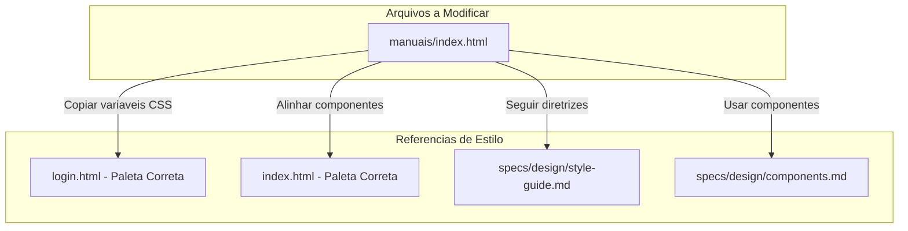
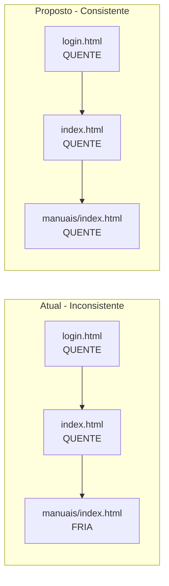

# Design Document: Unificacao Visual - Pagina de Manuais

**Data**: 2026-01-09
**Versao**: 1.0
**Autor**: Prisma Design Agent
**Status**: Em Revisao
**Prioridade**: Alta

---

## 1. Overview

### 1.1 Objetivo

Este documento especifica as alteracoes necessarias para unificar a paleta de cores da pagina `manuais/index.html` com o restante do portal Al Sultan (login.html e index.html), garantindo consistencia visual e alinhamento com a identidade da marca.

### 1.2 Problema Identificado

A pagina de manuais utiliza uma paleta FRIA (verde escuro) que destoa completamente das demais paginas do portal que utilizam a paleta QUENTE oficial da marca Al Sultan.

```
PALETA INCORRETA (manuais/index.html)     PALETA CORRETA (login.html, index.html)
+-----------------------------------+     +-----------------------------------+
| Verde Escuro: #0a1a0a             |     | Laranja:      #ea5512             |
| Verde:        #0d2d0d             |     | Laranja Dark: #c94510             |
| Verde Esmeralda: #1a4d1a          |     | Laranja Light:#ff6b2c             |
| Dourado:      #d4af37             |     | Dourado:      #ffca07             |
| Creme:        #faf8f5             |     | Areia Light:  #faf6f0             |
| Areia:        #e8e4dc             |     | Areia:        #f5ebe0             |
+-----------------------------------+     | Creme:        #fff8f0             |
                                          | Marrom Dark:  #2d1810             |
                                          | Marrom Medium:#5c3d2e             |
                                          +-----------------------------------+
```

### 1.3 Impacto Visual

O usuario que navega de `index.html` para `manuais/` experimenta uma quebra visual abrupta:

1. **Background**: Muda de tons claros/arenosos para verde escuro
2. **Cards**: Mudam de fundo creme para glass-effect verde
3. **Acentos**: Mudam de laranja vibrante para dourado opaco
4. **Atmosfera**: Muda de acolhedora/quente para fria/corporativa

---

## 2. Architecture Design

### 2.1 Estrutura de Arquivos Afetados



### 2.2 Fluxo de Navegacao Visual



---

## 3. Mapeamento de Cores: Antigas para Novas

### 3.1 Tabela de Conversao Completa

| Contexto | Cor Atual (FRIA) | Hex Atual | Cor Nova (QUENTE) | Hex Novo |
|----------|------------------|-----------|-------------------|----------|
| Background primario | Verde escuro | `#0a1a0a` | Areia light | `#faf6f0` |
| Background gradiente | Verde | `#0d2d0d` | Areia | `#f5ebe0` |
| Cor de texto principal | Creme | `#faf8f5` | Marrom escuro | `#2d1810` |
| Cor de texto secundario | Creme/60 | `rgba(faf8f5, 0.6)` | Marrom medio | `#5c3d2e` |
| Cor de destaque | Dourado | `#d4af37` | Laranja | `#ea5512` |
| Cor de destaque hover | Dourado claro | `#f0d77a` | Laranja dark | `#c94510` |
| Cor de acento secundario | Dourado | `#d4af37` | Dourado Al Sultan | `#ffca07` |
| Borda de cards | Dourado/15 | `rgba(d4af37, 0.15)` | Areia dark | `#e6d5c3` |
| Borda hover | Dourado/40 | `rgba(d4af37, 0.4)` | Laranja | `#ea5512` |
| Glass background | Verde/40 | `rgba(0d2d0d, 0.4)` | Laranja/5 | `rgba(ea5512, 0.05)` |
| Sombra hover | Dourado/15 | `rgba(d4af37, 0.15)` | Laranja/15 | `rgba(ea5512, 0.15)` |

### 3.2 Cores Semanticas para Badges

| Badge | Cor Atual | Cor Nova | Justificativa |
|-------|-----------|----------|---------------|
| "Para Todos" | Dourado | Laranja `#ea5512` | Destaque principal |
| "Diretoria" | Azul | Azul `#3b82f6` | Manter (alinhado com index.html) |
| "Gerentes" | Ciano | Teal `#0bb0a0` | Manter (alinhado com index.html) |
| "Analistas" | Roxo | Roxo `#8b5cf6` | Manter (alinhado com index.html) |

---

## 4. Componentes CSS a Atualizar

### 4.1 Tailwind Config

**ANTES** (manuais/index.html, linha 24-44):

```javascript
tailwind.config = {
    theme: {
        extend: {
            colors: {
                sultan: {
                    dark: '#0a1a0a',      // REMOVER
                    green: '#0d2d0d',     // REMOVER
                    emerald: '#1a4d1a',   // REMOVER
                    gold: '#d4af37',      // ATUALIZAR
                    goldLight: '#f0d77a', // REMOVER
                    cream: '#faf8f5',     // ATUALIZAR
                    sand: '#e8e4dc'       // ATUALIZAR
                }
            },
            fontFamily: {
                display: ['Playfair Display', 'serif'],
                sans: ['Inter', 'sans-serif'],
            }
        }
    }
}
```

**DEPOIS**:

```javascript
tailwind.config = {
    theme: {
        extend: {
            colors: {
                sultan: {
                    orange: '#ea5512',
                    orangeDark: '#c94510',
                    orangeLight: '#ff6b2c',
                    gold: '#ffca07',
                    goldLight: '#ffe066',
                    red: '#e5123c',
                    teal: '#0bb0a0',
                    sandLight: '#faf6f0',
                    sand: '#f5ebe0',
                    sandDark: '#e6d5c3',
                    cream: '#fff8f0',
                    brownDark: '#2d1810',
                    brownMedium: '#5c3d2e'
                }
            },
            fontFamily: {
                display: ['Playfair Display', 'serif'],
                sans: ['Poppins', 'sans-serif'],  // Mudar de Inter para Poppins
            }
        }
    }
}
```

### 4.2 Body e Background

**ANTES** (linha 48-51):

```css
body {
    background: linear-gradient(180deg, #0a1a0a 0%, #0d2d0d 100%);
    color: #faf8f5;
    min-height: 100vh;
}
```

**DEPOIS**:

```css
body {
    background: linear-gradient(180deg, #faf6f0 0%, #f5ebe0 100%);
    color: #2d1810;
    min-height: 100vh;
}
```

### 4.3 Glass Card

**ANTES** (linha 54-61):

```css
.glass-card {
    background: rgba(13, 45, 13, 0.4);
    backdrop-filter: blur(16px);
    border: 1px solid rgba(212, 175, 55, 0.15);
    transition: all 0.3s ease;
}

.glass-card:hover {
    background: rgba(13, 45, 13, 0.6);
    border-color: rgba(212, 175, 55, 0.3);
}
```

**DEPOIS**:

```css
.glass-card {
    background: rgba(255, 248, 240, 0.9);
    backdrop-filter: blur(16px);
    border: 1px solid #e6d5c3;
    transition: all 0.3s ease;
}

.glass-card:hover {
    background: rgba(255, 248, 240, 1);
    border-color: rgba(234, 85, 18, 0.3);
}
```

### 4.4 Manual Card

**ANTES** (linha 66-74):

```css
.manual-card {
    background: linear-gradient(135deg, rgba(13, 45, 13, 0.5) 0%, rgba(10, 26, 10, 0.7) 100%);
    border: 1px solid rgba(212, 175, 55, 0.15);
    transition: all 0.3s ease;
}

.manual-card:hover {
    border-color: rgba(212, 175, 55, 0.4);
    transform: translateY(-4px);
    box-shadow: 0 16px 48px rgba(212, 175, 55, 0.15);
}
```

**DEPOIS**:

```css
.manual-card {
    background: linear-gradient(135deg, rgba(255, 248, 240, 0.95) 0%, rgba(250, 246, 240, 0.98) 100%);
    border: 1px solid #e6d5c3;
    transition: all 0.3s ease;
}

.manual-card:hover {
    border-color: #ea5512;
    transform: translateY(-4px);
    box-shadow: 0 16px 48px rgba(234, 85, 18, 0.15);
}
```

### 4.5 Decorative Line

**ANTES** (linha 77-80):

```css
.decorative-line {
    height: 1px;
    background: linear-gradient(90deg, transparent, #d4af37, transparent);
}
```

**DEPOIS**:

```css
.decorative-line {
    height: 1px;
    background: linear-gradient(90deg, transparent, #ea5512, transparent);
}
```

### 4.6 Scrollbar

**ANTES** (linha 82-85):

```css
::-webkit-scrollbar { width: 8px; }
::-webkit-scrollbar-track { background: #0a1a0a; }
::-webkit-scrollbar-thumb { background: rgba(212, 175, 55, 0.3); border-radius: 4px; }
```

**DEPOIS**:

```css
::-webkit-scrollbar { width: 8px; }
::-webkit-scrollbar-track { background: #faf6f0; }
::-webkit-scrollbar-thumb { background: #e6d5c3; border-radius: 4px; }
::-webkit-scrollbar-thumb:hover { background: #5c3d2e; }
```

---

## 5. Componentes HTML a Atualizar

### 5.1 Header (linha 101-123)

**Mudancas de Classe Tailwind**:

| Elemento | Classe Atual | Classe Nova |
|----------|--------------|-------------|
| Header container | `bg-sultan-dark/80` | `bg-white/90` |
| Border | `border-sultan-gold/10` | `border-sultan-sandDark` |
| Link voltar | `text-sultan-cream/60` | `text-sultan-brownMedium` |
| Link hover | `hover:text-sultan-cream` | `hover:text-sultan-brownDark` |
| Separador | `text-sultan-cream/30` | `text-sultan-sandDark` |
| Icone livro bg | `bg-sultan-gold/20` | `bg-sultan-orange/10` |
| Icone livro cor | `text-sultan-gold` | `text-sultan-orange` |
| Titulo | `text-sultan-cream` | `text-sultan-brownDark` |
| Subtitulo | `text-sultan-cream/40` | `text-sultan-brownMedium` |

### 5.2 Secao Principal (linha 129-137)

**Mudancas de Classe**:

| Elemento | Classe Atual | Classe Nova |
|----------|--------------|-------------|
| Titulo H1 | `text-sultan-cream` | `text-sultan-brownDark` |
| Descricao | `text-sultan-cream/60` | `text-sultan-brownMedium` |

### 5.3 Manual Cards (linha 142-282)

Para CADA card de manual, aplicar:

| Elemento | Classe Atual | Classe Nova |
|----------|--------------|-------------|
| Card background | (via CSS .manual-card) | (atualizado via CSS) |
| Icone container | `bg-sultan-gold/20` | `bg-sultan-orange/10` |
| Icone cor | `text-sultan-gold` | `text-sultan-orange` |
| Badge texto | `text-sultan-gold` | `text-sultan-orange` |
| Badge bg | `bg-sultan-gold/20` | `bg-sultan-orange/15` |
| Titulo card | `text-sultan-cream` | `text-sultan-brownDark` |
| Titulo hover | `group-hover:text-sultan-gold` | `group-hover:text-sultan-orange` |
| Descricao | `text-sultan-cream/60` | `text-sultan-brownMedium` |
| Meta info | `text-sultan-cream/50` | `text-sultan-brownMedium/70` |
| Borda footer | `border-sultan-gold/10` | `border-sultan-sandDark` |
| Versao | `text-sultan-cream/50` | `text-sultan-brownMedium` |
| Link "Abrir" | `text-sultan-gold` | `text-sultan-orange` |

**Nota**: Os badges coloridos (Diretoria=azul, Gerentes=ciano, Analistas=roxo) devem MANTER suas cores atuais pois estao alinhados com o index.html.

### 5.4 Recursos Adicionais (linha 286-323)

**Mudancas de Classe**:

| Elemento | Classe Atual | Classe Nova |
|----------|--------------|-------------|
| Titulo secao | `text-sultan-cream/50` | `text-sultan-brownMedium` |
| Card bg | (via CSS .glass-card) | (atualizado via CSS) |
| Icone container | `bg-sultan-gold/20` | `bg-sultan-orange/10` |
| Icone cor | `text-sultan-gold` | `text-sultan-orange` |
| Titulo card | `text-sultan-cream` | `text-sultan-brownDark` |
| Descricao | `text-sultan-cream/50` | `text-sultan-brownMedium` |

### 5.5 Quick Info (linha 326-351)

**Mudancas de Classe**:

| Elemento | Classe Atual | Classe Nova |
|----------|--------------|-------------|
| Icone info | `text-sultan-gold` | `text-sultan-orange` |
| Titulo | `text-sultan-cream` | `text-sultan-brownDark` |
| Texto | `text-sultan-cream/70` | `text-sultan-brownMedium` |
| Icone check | `text-green-400` | `text-sultan-teal` (manter ou alinhar) |
| Icone calendario | `text-sultan-gold` | `text-sultan-orange` |

### 5.6 Footer (linha 355-360)

**Mudancas de Classe**:

| Elemento | Classe Atual | Classe Nova |
|----------|--------------|-------------|
| Border | `border-sultan-gold/10` | `border-sultan-sandDark` |
| Texto | `text-sultan-cream/40` | `text-sultan-brownMedium` |

---

## 6. Melhorias UX Adicionais Propostas

### 6.1 Adicionar Breadcrumb Navegacional

**Proposta**: Substituir o link "Voltar" simples por um breadcrumb mais informativo.

```html
<!-- ATUAL -->
<a href="../index.html" class="...">
    <i class="fas fa-arrow-left"></i>
    <span>Voltar</span>
</a>

<!-- PROPOSTO -->
<nav aria-label="Breadcrumb" class="flex items-center gap-2 text-sm">
    <a href="../index.html" class="text-sultan-brownMedium hover:text-sultan-orange">
        <i class="fas fa-home"></i>
    </a>
    <span class="text-sultan-sandDark">/</span>
    <span class="text-sultan-brownDark font-medium">Manuais</span>
</nav>
```

### 6.2 Adicionar Indicador de Leitura Estimada

**Proposta**: Destacar visualmente o tempo de leitura com icones mais expressivos.

```html
<!-- ATUAL -->
<span><i class="fas fa-clock mr-1"></i> 15 min leitura</span>

<!-- PROPOSTO -->
<div class="flex items-center gap-1 px-2 py-1 bg-sultan-sandLight rounded-full">
    <i class="fas fa-book-reader text-sultan-orange text-xs"></i>
    <span class="text-xs font-medium">15 min</span>
</div>
```

### 6.3 Adicionar Search/Filter de Manuais

**Proposta**: Para escalabilidade futura, adicionar campo de busca.

```html
<div class="mb-8 max-w-md mx-auto">
    <div class="relative">
        <input
            type="text"
            placeholder="Buscar manual..."
            class="w-full px-4 py-3 pl-12 bg-white border border-sultan-sandDark rounded-xl
                   focus:outline-none focus:border-sultan-orange focus:ring-2
                   focus:ring-sultan-orange/20 transition-all"
        >
        <i class="fas fa-search absolute left-4 top-1/2 -translate-y-1/2 text-sultan-brownMedium"></i>
    </div>
</div>
```

### 6.4 Melhorar Hierarquia Visual dos Cards

**Proposta**: Diferenciar visualmente o "Manual Geral" como ponto de entrada principal.

```css
/* Card Principal (Manual Geral) */
.manual-card.featured {
    border: 2px solid rgba(234, 85, 18, 0.3);
    background: linear-gradient(135deg,
        rgba(255, 202, 7, 0.05) 0%,
        rgba(255, 248, 240, 0.98) 100%);
}

.manual-card.featured::before {
    content: '';
    position: absolute;
    top: 0;
    left: 0;
    right: 0;
    height: 4px;
    background: var(--gradient-warm);
    border-radius: 16px 16px 0 0;
}
```

### 6.5 Adicionar Animacao de Entrada

**Proposta**: Cards aparecem com animacao suave ao carregar a pagina.

```css
.manual-card {
    animation: fadeInUp 0.5s ease-out;
    animation-fill-mode: both;
}

.manual-card:nth-child(1) { animation-delay: 0.1s; }
.manual-card:nth-child(2) { animation-delay: 0.2s; }
.manual-card:nth-child(3) { animation-delay: 0.3s; }
.manual-card:nth-child(4) { animation-delay: 0.4s; }

@keyframes fadeInUp {
    from {
        opacity: 0;
        transform: translateY(20px);
    }
    to {
        opacity: 1;
        transform: translateY(0);
    }
}
```

### 6.6 Adicionar Status de "Novo" ou "Atualizado"

**Proposta**: Badge para indicar manuais recentemente atualizados.

```html
<!-- Adicionar no card quando aplicavel -->
<div class="absolute top-4 right-4">
    <span class="px-2 py-1 bg-sultan-teal text-white text-[10px] uppercase
                 tracking-wider rounded-full font-medium">
        Atualizado
    </span>
</div>
```

---

## 7. Tipografia

### 7.1 Atualizacao de Fonte

**Mudanca Necessaria**: Substituir `Inter` por `Poppins` para consistencia.

**Link atual** (linha 17-18):
```html
<link href="https://fonts.googleapis.com/css2?family=Playfair+Display:wght@400;500;600;700&family=Inter:wght@300;400;500;600;700&display=swap" rel="stylesheet">
```

**Link novo**:
```html
<link href="https://fonts.googleapis.com/css2?family=Playfair+Display:wght@400;500;600;700;800&family=Poppins:wght@300;400;500;600;700&display=swap" rel="stylesheet">
```

### 7.2 Tailwind Font Config

```javascript
fontFamily: {
    display: ['Playfair Display', 'serif'],
    sans: ['Poppins', 'sans-serif'],  // Mudanca de Inter para Poppins
}
```

---

## 8. Testes e Validacao

### 8.1 Checklist de Validacao Visual

| Teste | Criterio de Aceite |
|-------|-------------------|
| Cores de fundo | Nenhum verde visivel |
| Cores de texto | Texto legivel em fundo claro |
| Cores de destaque | Laranja (#ea5512) como cor principal |
| Consistencia com login.html | Paleta identica |
| Consistencia com index.html | Paleta identica |
| Responsividade | Funcional em mobile/tablet/desktop |
| Hover states | Todos funcionais com novas cores |
| Contraste WCAG | AA minimo em todas as combinacoes |

### 8.2 Matriz de Contraste

| Combinacao | Ratio Esperado | Status |
|------------|----------------|--------|
| Marrom Escuro (#2d1810) / Areia Light (#faf6f0) | 12.5:1 | AAA |
| Marrom Medio (#5c3d2e) / Areia Light (#faf6f0) | 7.8:1 | AAA |
| Laranja (#ea5512) / Branco | 4.6:1 | AA |
| Marrom Escuro (#2d1810) / Creme (#fff8f0) | 12.3:1 | AAA |

### 8.3 Fluxo de Teste Manual

1. Acessar `login.html` - Observar paleta quente
2. Fazer login
3. Acessar `index.html` - Confirmar paleta quente consistente
4. Clicar em "Manuais" na sidebar
5. Acessar `manuais/index.html` - Verificar paleta quente aplicada
6. Testar hover em todos os cards
7. Testar clique nos links
8. Verificar responsividade (resize janela)
9. Verificar acessibilidade (navegacao por teclado)

---

## 9. Impacto e Riscos

### 9.1 Arquivos Afetados

| Arquivo | Tipo de Mudanca | Linhas Afetadas | Risco |
|---------|-----------------|-----------------|-------|
| `manuais/index.html` | CSS + Classes Tailwind | ~200 linhas | Medio |

### 9.2 Riscos Identificados

| Risco | Probabilidade | Impacto | Mitigacao |
|-------|---------------|---------|-----------|
| Quebra de layout | Baixa | Medio | Testar em multiplos navegadores |
| Perda de legibilidade | Baixa | Alto | Verificar contraste WCAG |
| Inconsistencia residual | Media | Baixo | Revisao visual detalhada |

### 9.3 Rollback

Em caso de problemas, reverter para commit anterior de `manuais/index.html`.

---

## 10. Estimativa de Implementacao

| Tarefa | Estimativa | Prioridade |
|--------|------------|------------|
| Atualizar CSS custom (body, cards, scrollbar) | 30 min | Alta |
| Atualizar Tailwind config | 15 min | Alta |
| Atualizar classes Tailwind no HTML | 1h | Alta |
| Atualizar Google Fonts import | 5 min | Alta |
| Testar e validar | 30 min | Alta |
| Implementar melhorias UX opcionais | 1h | Media |

**Total estimado**: 2h30min (essencial) + 1h (melhorias UX)

---

## 11. Codigo Completo para Substituicao

### 11.1 Bloco CSS Completo (substituir linhas 47-86)

```css
<style>
    body {
        background: linear-gradient(180deg, #faf6f0 0%, #f5ebe0 100%);
        color: #2d1810;
        min-height: 100vh;
    }

    .glass-card {
        background: rgba(255, 248, 240, 0.9);
        backdrop-filter: blur(16px);
        border: 1px solid #e6d5c3;
        transition: all 0.3s ease;
    }

    .glass-card:hover {
        background: rgba(255, 248, 240, 1);
        border-color: rgba(234, 85, 18, 0.3);
    }

    .manual-card {
        background: linear-gradient(135deg, rgba(255, 248, 240, 0.95) 0%, rgba(250, 246, 240, 0.98) 100%);
        border: 1px solid #e6d5c3;
        transition: all 0.3s ease;
    }

    .manual-card:hover {
        border-color: #ea5512;
        transform: translateY(-4px);
        box-shadow: 0 16px 48px rgba(234, 85, 18, 0.15);
    }

    .decorative-line {
        height: 1px;
        background: linear-gradient(90deg, transparent, #ea5512, transparent);
    }

    ::-webkit-scrollbar { width: 8px; }
    ::-webkit-scrollbar-track { background: #faf6f0; }
    ::-webkit-scrollbar-thumb { background: #e6d5c3; border-radius: 4px; }
    ::-webkit-scrollbar-thumb:hover { background: #5c3d2e; }

    /* Animacao de entrada */
    .manual-card {
        animation: fadeInUp 0.5s ease-out;
        animation-fill-mode: both;
    }
    .manual-card:nth-child(1) { animation-delay: 0.1s; }
    .manual-card:nth-child(2) { animation-delay: 0.2s; }
    .manual-card:nth-child(3) { animation-delay: 0.3s; }
    .manual-card:nth-child(4) { animation-delay: 0.4s; }

    @keyframes fadeInUp {
        from { opacity: 0; transform: translateY(20px); }
        to { opacity: 1; transform: translateY(0); }
    }
</style>
```

---

## 12. Proximos Passos

1. **Aprovacao**: Revisar e aprovar este documento de design
2. **Implementacao**: Aplicar mudancas em `manuais/index.html`
3. **Teste**: Validar visualmente e funcionalmente
4. **Deploy**: Publicar alteracoes
5. **Documentacao**: Atualizar style-guide.md se necessario

---

## 13. Anexos

### 13.1 Screenshot Comparativo (Conceitual)

```
+------------------------+    +------------------------+
|    ANTES (FRIO)        |    |    DEPOIS (QUENTE)     |
|                        |    |                        |
|  +------------------+  |    |  +------------------+  |
|  | [Verde Escuro]   |  |    |  | [Areia/Creme]    |  |
|  | Header           |  |    |  | Header           |  |
|  +------------------+  |    |  +------------------+  |
|                        |    |                        |
|  +------+ +------+    |    |  +------+ +------+    |
|  |Card  | |Card  |    |    |  |Card  | |Card  |    |
|  |Verde | |Verde |    |    |  |Creme | |Creme |    |
|  |Gold  | |Gold  |    |    |  |Orange| |Orange|    |
|  +------+ +------+    |    |  +------+ +------+    |
|                        |    |                        |
+------------------------+    +------------------------+
```

### 13.2 Referencias

- `docs/web/login.html` - Paleta de referencia
- `docs/web/index.html` - Componentes de referencia
- `docs/web/specs/design/style-guide.md` - Guia de estilo oficial
- `docs/web/specs/design/components.md` - Biblioteca de componentes

---

**Documento criado em**: 2026-01-09
**Autor**: Prisma Design Agent
**Aprovacao pendente**: Sim

---

O design esta adequado? Podemos prosseguir para a implementacao?
