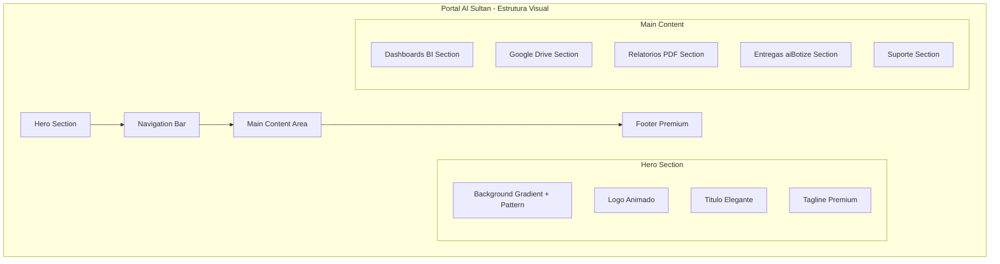

# Al Sultan Centro de Comando - Redesign Visual v4.0

## Design Document - Portal Elegante e Profissional

**Data**: 2026-01-09
**Versao**: 4.0
**Autor**: Design System Team
**Status**: Production Ready

---

## 1. Vision Statement

### 1.1 Objetivo do Redesign

Criar uma experiencia visual **formidavel**, **elegante** e **profissional** para o Centro de Comando Al Sultan, que transmita:

- **Sofisticacao Premium**: Digno de uma marca de culinaria arabe de alto padrao
- **Calor e Acolhimento**: Cores quentes que remetem a hospitalidade arabe
- **Profissionalismo**: Interface limpa, organizada e funcional
- **Identidade Cultural**: Elementos visuais arabes sutis e refinados

### 1.2 Principios de Design

```
+------------------------------------------------------------------+
|                     PRINCIPIOS VISUAIS                            |
+------------------------------------------------------------------+
|                                                                   |
|   ELEGANCIA          FUNCIONALIDADE       IDENTIDADE              |
|   +---------+        +---------+          +---------+             |
|   | Espacos |        | Hierarquia|        | Patterns|             |
|   | generosos|       | clara    |         | arabes  |             |
|   | e limpos |       | de info  |         | sutis   |             |
|   +---------+        +---------+          +---------+             |
|                                                                   |
|   CORES QUENTES      TIPOGRAFIA           MICRO-INTERACOES        |
|   +---------+        +---------+          +---------+             |
|   | Laranja |        | Playfair |         | Hover   |             |
|   | Dourado |        | Display  |         | suaves  |             |
|   | Teal    |        | elegante |         | e fluidos|            |
|   +---------+        +---------+          +---------+             |
|                                                                   |
+------------------------------------------------------------------+
```

---

## 2. Paleta de Cores - Sistema Completo

### 2.1 Cores Primarias da Marca

```css
:root {
    /* ========== BRAND COLORS - AL SULTAN ========== */

    /* Laranja - Cor Principal (Energia, Apetite, Calor) */
    --sultan-orange: #ea5512;
    --sultan-orange-dark: #c94510;
    --sultan-orange-light: #ff6b2c;
    --sultan-orange-glow: rgba(234, 85, 18, 0.15);

    /* Dourado - Destaque (Premium, Luxo, Excelencia) */
    --sultan-gold: #ffca07;
    --sultan-gold-dark: #d4a000;
    --sultan-gold-light: #ffe066;
    --sultan-gold-glow: rgba(255, 202, 7, 0.2);

    /* Teal - Sucesso/Accent (Confianca, Frescor) */
    --sultan-teal: #0bb0a0;
    --sultan-teal-dark: #088f82;
    --sultan-teal-light: #3dd4c4;
    --sultan-teal-glow: rgba(11, 176, 160, 0.15);

    /* Vermelho - Alerta */
    --sultan-red: #e5123c;
    --sultan-red-light: #ff4d6a;
}
```

### 2.2 Cores Neutras e Superficies

```css
:root {
    /* ========== SURFACE COLORS ========== */

    /* Backgrounds Claros (Light Mode) */
    --surface-cream: #faf6f0;      /* Fundo principal */
    --surface-sand: #f5ebe0;       /* Fundo secundario */
    --surface-sand-dark: #e6d5c3;  /* Bordas e divisores */
    --surface-white: #fff8f0;      /* Cards e containers */

    /* Backgrounds Escuros (Sidebar e overlays) */
    --surface-dark: #1a0a05;       /* Sidebar background */
    --surface-brown: #2d1810;      /* Sidebar secundario */
    --surface-warm-brown: #3d251a; /* Hover states escuros */

    /* ========== TEXT COLORS ========== */

    --text-primary: #2d1810;       /* Texto principal */
    --text-secondary: #5c3d2e;     /* Texto secundario */
    --text-muted: #8b6b5a;         /* Texto discreto */
    --text-inverse: #faf6f0;       /* Texto em fundo escuro */
    --text-gold: #d4a000;          /* Texto dourado */
}
```

### 2.3 Gradientes Premium

```css
:root {
    /* ========== GRADIENTS ========== */

    /* Hero e Banners */
    --gradient-hero: linear-gradient(135deg,
        #ff6b2c 0%,
        #ea5512 35%,
        #c94510 70%,
        #2d1810 100%
    );

    /* Sunset (Botoes CTA) */
    --gradient-sunset: linear-gradient(135deg,
        #ea5512 0%,
        #ffca07 100%
    );

    /* Warm Glass (Cards Premium) */
    --gradient-warm-glass: linear-gradient(135deg,
        rgba(234, 85, 18, 0.08) 0%,
        rgba(255, 202, 7, 0.05) 100%
    );

    /* Sidebar */
    --gradient-sidebar: linear-gradient(180deg,
        #1a0a05 0%,
        #2d1810 50%,
        #3d251a 100%
    );

    /* Sand Background */
    --gradient-sand: linear-gradient(180deg,
        #faf6f0 0%,
        #f5ebe0 100%
    );

    /* Gold Shimmer (Badges e destaques) */
    --gradient-gold: linear-gradient(135deg,
        #ffca07 0%,
        #ffa500 50%,
        #ffca07 100%
    );
}
```

### 2.4 Aplicacao Visual de Cores

```
+------------------------------------------------------------------------+
|                          HERO SECTION                                   |
|  Background: gradient-hero                                              |
|  Texto: text-inverse (#faf6f0)                                         |
|  Accent: sultan-gold                                                    |
+------------------------------------------------------------------------+
|                                                                        |
| +--SIDEBAR--+  +------------------MAIN CONTENT-------------------+     |
| |           |  |                                                  |     |
| | gradient- |  |  Background: surface-cream                       |     |
| | sidebar   |  |                                                  |     |
| |           |  |  +--CARD----------------------------------+      |     |
| | Text:     |  |  | Background: surface-white             |      |     |
| | text-     |  |  | Border: sand-dark                     |      |     |
| | inverse   |  |  | Heading: text-primary + Playfair      |      |     |
| |           |  |  | Body: text-secondary                  |      |     |
| | Active:   |  |  | Icon: sultan-orange                   |      |     |
| | sultan-   |  |  | Hover Border: sultan-orange           |      |     |
| | orange    |  |  +----------------------------------------+      |     |
| |           |  |                                                  |     |
| +-----------+  +--------------------------------------------------+     |
|                                                                        |
+------------------------------------------------------------------------+
|                           FOOTER                                        |
|  Background: surface-cream  |  Border-top: sultan-gold (10%)           |
|  Text: text-muted           |  Link: sultan-teal                       |
+------------------------------------------------------------------------+
```

---

## 3. Arquitetura Visual - Layout Redesenhado

### 3.1 Estrutura de Pagina



### 3.2 Grid System

```css
/* Sistema de Grid Premium */
.grid-container {
    display: grid;
    gap: 2rem;
    padding: 2rem;
    max-width: 1400px;
    margin: 0 auto;
}

/* Grid de 3 colunas para cards principais */
.grid-3 {
    grid-template-columns: repeat(3, 1fr);
}

/* Grid de 2 colunas para secoes maiores */
.grid-2 {
    grid-template-columns: repeat(2, 1fr);
}

/* Grid de 4 colunas para quick actions */
.grid-4 {
    grid-template-columns: repeat(4, 1fr);
}

/* Responsividade */
@media (max-width: 1200px) {
    .grid-3, .grid-4 { grid-template-columns: repeat(2, 1fr); }
}

@media (max-width: 768px) {
    .grid-3, .grid-4, .grid-2 { grid-template-columns: 1fr; }
}
```

---

## 4. Componentes Visuais Premium

### 4.1 Hero Section - Banner Elegante

```css
/* ========== HERO SECTION ========== */

.hero-section {
    position: relative;
    min-height: 280px;
    background: var(--gradient-hero);
    overflow: hidden;
    display: flex;
    align-items: center;
    padding: 3rem 2rem;
}

/* Overlay com Pattern Arabe */
.hero-section::before {
    content: '';
    position: absolute;
    inset: 0;
    background-image: url("data:image/svg+xml,%3Csvg width='60' height='60' viewBox='0 0 60 60' xmlns='http://www.w3.org/2000/svg'%3E%3Cg fill='none' fill-rule='evenodd'%3E%3Cg fill='%23ffffff' fill-opacity='0.06'%3E%3Cpath d='M30 0l30 30-30 30L0 30zM30 8l22 22-22 22L8 30z'/%3E%3C/g%3E%3C/g%3E%3C/svg%3E");
    animation: patternFloat 40s linear infinite;
    pointer-events: none;
}

/* Circulos Decorativos */
.hero-section::after {
    content: '';
    position: absolute;
    width: 500px;
    height: 500px;
    border-radius: 50%;
    background: radial-gradient(circle, rgba(255,202,7,0.15) 0%, transparent 70%);
    top: -200px;
    right: -150px;
    pointer-events: none;
}

.hero-content {
    position: relative;
    z-index: 1;
    max-width: 1400px;
    margin: 0 auto;
    width: 100%;
    display: flex;
    align-items: center;
    justify-content: space-between;
}

.hero-branding {
    display: flex;
    align-items: center;
    gap: 1.5rem;
}

.hero-logo {
    width: 80px;
    height: 80px;
    background: rgba(255, 255, 255, 0.15);
    backdrop-filter: blur(10px);
    border-radius: 20px;
    border: 2px solid rgba(255, 255, 255, 0.2);
    display: flex;
    align-items: center;
    justify-content: center;
    font-size: 3rem;
    animation: logoFloat 4s ease-in-out infinite;
    box-shadow: 0 10px 40px rgba(0, 0, 0, 0.2);
}

.hero-text h1 {
    font-family: 'Playfair Display', serif;
    font-size: 2.5rem;
    font-weight: 800;
    color: white;
    text-shadow: 0 4px 20px rgba(0, 0, 0, 0.3);
    letter-spacing: 2px;
    margin-bottom: 0.25rem;
}

.hero-text p {
    font-size: 1rem;
    color: var(--sultan-gold);
    font-weight: 500;
    letter-spacing: 3px;
    text-transform: uppercase;
}

.hero-status {
    display: flex;
    align-items: center;
    gap: 1rem;
}

.status-badge {
    display: flex;
    align-items: center;
    gap: 0.5rem;
    padding: 0.75rem 1.25rem;
    background: rgba(11, 176, 160, 0.2);
    border: 1px solid rgba(11, 176, 160, 0.3);
    border-radius: 50px;
    color: white;
    font-size: 0.875rem;
    font-weight: 500;
}

.status-dot {
    width: 10px;
    height: 10px;
    background: var(--sultan-teal);
    border-radius: 50%;
    animation: pulse 2s cubic-bezier(0.4, 0, 0.6, 1) infinite;
    box-shadow: 0 0 10px var(--sultan-teal);
}

@keyframes logoFloat {
    0%, 100% { transform: translateY(0) rotate(0deg); }
    50% { transform: translateY(-8px) rotate(2deg); }
}

@keyframes patternFloat {
    0% { background-position: 0 0; }
    100% { background-position: 60px 60px; }
}

@keyframes pulse {
    0%, 100% { opacity: 1; transform: scale(1); }
    50% { opacity: 0.6; transform: scale(0.95); }
}
```

### 4.2 Section Headers - Titulos Elegantes

```css
/* ========== SECTION HEADERS ========== */

.section-header {
    display: flex;
    align-items: center;
    justify-content: space-between;
    margin-bottom: 1.5rem;
    padding-bottom: 1rem;
    border-bottom: 1px solid var(--sultan-orange-glow);
}

.section-title {
    display: flex;
    align-items: center;
    gap: 0.75rem;
}

.section-title h2 {
    font-family: 'Playfair Display', serif;
    font-size: 1.5rem;
    font-weight: 700;
    color: var(--text-primary);
}

.section-icon {
    width: 40px;
    height: 40px;
    background: var(--gradient-sunset);
    border-radius: 12px;
    display: flex;
    align-items: center;
    justify-content: center;
    color: white;
    font-size: 1rem;
    box-shadow: 0 4px 15px var(--sultan-orange-glow);
}

.section-action {
    display: flex;
    align-items: center;
    gap: 0.5rem;
    color: var(--sultan-teal);
    font-size: 0.875rem;
    font-weight: 600;
    text-decoration: none;
    transition: all 0.2s ease;
}

.section-action:hover {
    color: var(--sultan-orange);
}

.section-action:hover i {
    transform: translateX(4px);
}

.section-action i {
    font-size: 0.75rem;
    transition: transform 0.2s ease;
}
```

### 4.3 Premium Cards - Dashboards BI

```css
/* ========== DASHBOARD CARDS (Premium) ========== */

.dashboard-card {
    position: relative;
    display: flex;
    align-items: center;
    gap: 1.25rem;
    padding: 1.5rem;
    background: var(--surface-white);
    border: 1px solid var(--surface-sand-dark);
    border-radius: 16px;
    text-decoration: none;
    overflow: hidden;
    transition: all 0.3s cubic-bezier(0.4, 0, 0.2, 1);
}

/* Linha decorativa lateral */
.dashboard-card::before {
    content: '';
    position: absolute;
    left: 0;
    top: 0;
    bottom: 0;
    width: 4px;
    background: var(--gradient-sunset);
    transform: scaleY(0);
    transition: transform 0.3s ease;
}

.dashboard-card:hover {
    border-color: var(--sultan-orange);
    box-shadow: 0 8px 30px var(--sultan-orange-glow);
    transform: translateY(-4px);
}

.dashboard-card:hover::before {
    transform: scaleY(1);
}

.dashboard-icon {
    width: 56px;
    height: 56px;
    border-radius: 14px;
    display: flex;
    align-items: center;
    justify-content: center;
    font-size: 1.5rem;
    flex-shrink: 0;
    transition: transform 0.3s ease;
}

.dashboard-card:hover .dashboard-icon {
    transform: scale(1.1);
}

/* Variantes de cor do icone */
.dashboard-icon.orange {
    background: linear-gradient(135deg, rgba(234, 85, 18, 0.15) 0%, rgba(234, 85, 18, 0.25) 100%);
    color: var(--sultan-orange);
}

.dashboard-icon.gold {
    background: linear-gradient(135deg, rgba(255, 202, 7, 0.15) 0%, rgba(255, 202, 7, 0.25) 100%);
    color: var(--sultan-gold-dark);
}

.dashboard-icon.teal {
    background: linear-gradient(135deg, rgba(11, 176, 160, 0.15) 0%, rgba(11, 176, 160, 0.25) 100%);
    color: var(--sultan-teal);
}

.dashboard-icon.blue {
    background: linear-gradient(135deg, rgba(59, 130, 246, 0.15) 0%, rgba(59, 130, 246, 0.25) 100%);
    color: #3b82f6;
}

.dashboard-icon.purple {
    background: linear-gradient(135deg, rgba(139, 92, 246, 0.15) 0%, rgba(139, 92, 246, 0.25) 100%);
    color: #8b5cf6;
}

.dashboard-content {
    flex: 1;
    min-width: 0;
}

.dashboard-title {
    font-family: 'Playfair Display', serif;
    font-size: 1.1rem;
    font-weight: 600;
    color: var(--text-primary);
    margin-bottom: 0.25rem;
}

.dashboard-desc {
    font-size: 0.85rem;
    color: var(--text-secondary);
    line-height: 1.4;
}

.dashboard-arrow {
    width: 32px;
    height: 32px;
    border-radius: 50%;
    background: var(--surface-sand);
    display: flex;
    align-items: center;
    justify-content: center;
    color: var(--text-muted);
    font-size: 0.75rem;
    transition: all 0.3s ease;
}

.dashboard-card:hover .dashboard-arrow {
    background: var(--sultan-orange);
    color: white;
    transform: translateX(4px);
}
```

### 4.4 Google Drive Section - Cards de Pastas

```css
/* ========== DRIVE FOLDER CARDS ========== */

.drive-section {
    background: var(--gradient-warm-glass);
    border: 1px solid var(--sultan-orange-glow);
    border-radius: 20px;
    padding: 2rem;
}

.drive-grid {
    display: grid;
    grid-template-columns: repeat(3, 1fr);
    gap: 1rem;
}

.drive-card {
    display: flex;
    align-items: center;
    gap: 1rem;
    padding: 1.25rem;
    background: var(--surface-white);
    border: 1px solid var(--surface-sand-dark);
    border-radius: 14px;
    text-decoration: none;
    transition: all 0.3s ease;
}

.drive-card:hover {
    border-color: var(--sultan-gold);
    box-shadow: 0 6px 20px var(--sultan-gold-glow);
    transform: translateY(-3px);
}

.drive-icon {
    width: 48px;
    height: 48px;
    border-radius: 12px;
    display: flex;
    align-items: center;
    justify-content: center;
    font-size: 1.25rem;
}

.drive-icon.financeiro {
    background: linear-gradient(135deg, #4285f4 0%, #1a73e8 100%);
    color: white;
}

.drive-icon.contratos {
    background: linear-gradient(135deg, #8b5cf6 0%, #7c3aed 100%);
    color: white;
}

.drive-icon.operacional {
    background: linear-gradient(135deg, var(--sultan-teal) 0%, #088f82 100%);
    color: white;
}

.drive-info h3 {
    font-size: 1rem;
    font-weight: 600;
    color: var(--text-primary);
    margin-bottom: 0.25rem;
}

.drive-info p {
    font-size: 0.8rem;
    color: var(--text-muted);
}

.drive-arrow {
    margin-left: auto;
    color: var(--text-muted);
    font-size: 0.75rem;
    transition: all 0.2s ease;
}

.drive-card:hover .drive-arrow {
    color: var(--sultan-gold);
    transform: translateX(3px);
}
```

### 4.5 Relatorios PDF Section

```css
/* ========== PDF REPORTS SECTION ========== */

.reports-section {
    background: var(--surface-white);
    border: 1px solid var(--surface-sand-dark);
    border-radius: 20px;
    padding: 2rem;
    position: relative;
    overflow: hidden;
}

/* Decoracao sutil */
.reports-section::before {
    content: '';
    position: absolute;
    width: 200px;
    height: 200px;
    border-radius: 50%;
    background: var(--sultan-teal-glow);
    top: -100px;
    right: -100px;
    pointer-events: none;
}

.reports-grid {
    display: grid;
    grid-template-columns: repeat(3, 1fr);
    gap: 1rem;
}

.report-card {
    position: relative;
    display: flex;
    align-items: flex-start;
    gap: 1rem;
    padding: 1.25rem;
    background: var(--surface-cream);
    border: 1px solid transparent;
    border-radius: 14px;
    text-decoration: none;
    transition: all 0.3s ease;
}

.report-card:hover {
    background: var(--surface-white);
    border-color: var(--sultan-teal);
    box-shadow: 0 6px 20px var(--sultan-teal-glow);
}

.report-card.current {
    border-color: var(--sultan-teal);
    background: linear-gradient(135deg, rgba(11, 176, 160, 0.05) 0%, rgba(11, 176, 160, 0.1) 100%);
}

.report-badge {
    position: absolute;
    top: -8px;
    right: 12px;
    padding: 4px 12px;
    background: var(--sultan-teal);
    color: white;
    font-size: 0.65rem;
    font-weight: 700;
    text-transform: uppercase;
    letter-spacing: 0.5px;
    border-radius: 20px;
    box-shadow: 0 4px 10px var(--sultan-teal-glow);
}

.report-icon {
    width: 44px;
    height: 44px;
    border-radius: 12px;
    background: linear-gradient(135deg, rgba(234, 85, 18, 0.1) 0%, rgba(234, 85, 18, 0.2) 100%);
    display: flex;
    align-items: center;
    justify-content: center;
    color: var(--sultan-orange);
    font-size: 1.1rem;
}

.report-content h4 {
    font-size: 1rem;
    font-weight: 600;
    color: var(--text-primary);
    margin-bottom: 0.5rem;
}

.report-meta {
    display: flex;
    gap: 1rem;
    font-size: 0.75rem;
    color: var(--text-muted);
}

.report-meta span {
    display: flex;
    align-items: center;
    gap: 0.25rem;
}

.report-meta i {
    color: var(--sultan-teal);
    font-size: 0.65rem;
}
```

### 4.6 Entregas aiBotize - Timeline Premium

```css
/* ========== AIBOTIZE DELIVERIES SECTION ========== */

.deliveries-section {
    background: linear-gradient(135deg, var(--surface-brown) 0%, var(--surface-dark) 100%);
    border: 1px solid rgba(234, 85, 18, 0.2);
    border-radius: 20px;
    padding: 2rem;
    color: var(--text-inverse);
    position: relative;
    overflow: hidden;
}

/* Pattern arabe sutil */
.deliveries-section::before {
    content: '';
    position: absolute;
    inset: 0;
    background-image: url("data:image/svg+xml,%3Csvg width='40' height='40' viewBox='0 0 40 40' xmlns='http://www.w3.org/2000/svg'%3E%3Cg fill='none' fill-rule='evenodd'%3E%3Cg fill='%23ea5512' fill-opacity='0.05'%3E%3Cpath d='M20 0l20 20-20 20L0 20z'/%3E%3C/g%3E%3C/g%3E%3C/svg%3E");
    pointer-events: none;
}

.deliveries-content {
    position: relative;
    z-index: 1;
}

.deliveries-header {
    display: flex;
    align-items: center;
    justify-content: space-between;
    margin-bottom: 1.5rem;
}

.deliveries-header h2 {
    display: flex;
    align-items: center;
    gap: 0.75rem;
    font-family: 'Playfair Display', serif;
    font-size: 1.5rem;
    font-weight: 700;
}

.deliveries-header h2 img {
    height: 28px;
    filter: brightness(0) invert(1);
}

.delivery-timeline {
    display: flex;
    flex-direction: column;
    gap: 1rem;
}

.delivery-item {
    display: flex;
    align-items: center;
    gap: 1.25rem;
    padding: 1.25rem;
    background: rgba(255, 255, 255, 0.05);
    border: 1px solid rgba(255, 255, 255, 0.1);
    border-radius: 14px;
    transition: all 0.3s ease;
}

.delivery-item:hover {
    background: rgba(255, 255, 255, 0.1);
    border-color: var(--sultan-gold-glow);
}

.delivery-date {
    display: flex;
    flex-direction: column;
    align-items: center;
    justify-content: center;
    width: 60px;
    height: 60px;
    background: var(--gradient-sunset);
    border-radius: 12px;
    flex-shrink: 0;
}

.delivery-date .day {
    font-size: 1.25rem;
    font-weight: 700;
    line-height: 1;
}

.delivery-date .month {
    font-size: 0.7rem;
    font-weight: 500;
    text-transform: uppercase;
    letter-spacing: 1px;
}

.delivery-info {
    flex: 1;
}

.delivery-info h4 {
    font-size: 1rem;
    font-weight: 600;
    margin-bottom: 0.25rem;
}

.delivery-info p {
    font-size: 0.85rem;
    color: rgba(255, 255, 255, 0.7);
}

.delivery-status {
    display: flex;
    align-items: center;
    gap: 0.5rem;
    padding: 0.5rem 1rem;
    background: rgba(11, 176, 160, 0.2);
    border: 1px solid rgba(11, 176, 160, 0.3);
    border-radius: 50px;
    font-size: 0.8rem;
    font-weight: 500;
}

.delivery-status.complete {
    background: rgba(11, 176, 160, 0.2);
    border-color: rgba(11, 176, 160, 0.3);
}

.delivery-status.pending {
    background: rgba(255, 202, 7, 0.2);
    border-color: rgba(255, 202, 7, 0.3);
}

.delivery-status i {
    font-size: 0.7rem;
}
```

### 4.7 Suporte Section

```css
/* ========== SUPPORT SECTION ========== */

.support-section {
    background: var(--surface-white);
    border: 1px solid var(--surface-sand-dark);
    border-radius: 20px;
    padding: 2rem;
}

.support-grid {
    display: grid;
    grid-template-columns: repeat(3, 1fr);
    gap: 1.5rem;
}

.support-card {
    display: flex;
    flex-direction: column;
    align-items: center;
    text-align: center;
    padding: 2rem 1.5rem;
    background: var(--gradient-warm-glass);
    border: 1px solid var(--sultan-orange-glow);
    border-radius: 16px;
    text-decoration: none;
    transition: all 0.3s ease;
}

.support-card:hover {
    border-color: var(--sultan-orange);
    box-shadow: 0 8px 30px var(--sultan-orange-glow);
    transform: translateY(-4px);
}

.support-icon {
    width: 64px;
    height: 64px;
    background: var(--gradient-sunset);
    border-radius: 16px;
    display: flex;
    align-items: center;
    justify-content: center;
    font-size: 1.5rem;
    color: white;
    margin-bottom: 1rem;
    box-shadow: 0 8px 20px var(--sultan-orange-glow);
}

.support-card h3 {
    font-family: 'Playfair Display', serif;
    font-size: 1.1rem;
    font-weight: 600;
    color: var(--text-primary);
    margin-bottom: 0.5rem;
}

.support-card p {
    font-size: 0.85rem;
    color: var(--text-secondary);
}
```

### 4.8 Footer Premium

```css
/* ========== FOOTER PREMIUM ========== */

.footer-premium {
    background: linear-gradient(180deg, var(--surface-cream) 0%, var(--surface-sand) 100%);
    border-top: 1px solid var(--sultan-gold-glow);
    padding: 2rem;
}

.footer-content {
    display: flex;
    align-items: center;
    justify-content: space-between;
    max-width: 1400px;
    margin: 0 auto;
}

.footer-brand {
    display: flex;
    align-items: center;
    gap: 1rem;
}

.footer-logo {
    width: 40px;
    height: 40px;
    background: var(--gradient-sunset);
    border-radius: 10px;
    display: flex;
    align-items: center;
    justify-content: center;
    font-size: 1.25rem;
}

.footer-text h4 {
    font-family: 'Playfair Display', serif;
    font-size: 1rem;
    font-weight: 600;
    color: var(--text-primary);
}

.footer-text p {
    font-size: 0.75rem;
    color: var(--text-muted);
}

.footer-credits {
    text-align: right;
}

.footer-credits p {
    font-size: 0.8rem;
    color: var(--text-secondary);
}

.footer-credits a {
    color: var(--sultan-teal);
    font-weight: 600;
    text-decoration: none;
    transition: color 0.2s;
}

.footer-credits a:hover {
    color: var(--sultan-orange);
}

.version-tag {
    display: inline-flex;
    align-items: center;
    gap: 0.25rem;
    padding: 0.25rem 0.75rem;
    background: var(--sultan-orange-glow);
    color: var(--sultan-orange);
    font-size: 0.7rem;
    font-weight: 600;
    border-radius: 20px;
    margin-top: 0.5rem;
}
```

---

## 5. Elementos Visuais Arabes

### 5.1 Arabic Pattern SVG (Embutido)

```svg
<!-- Pattern Geometrico Arabe - Losango -->
<svg width="60" height="60" viewBox="0 0 60 60" xmlns="http://www.w3.org/2000/svg">
    <g fill="none" fill-rule="evenodd">
        <g fill="currentColor" fill-opacity="0.06">
            <path d="M30 0l30 30-30 30L0 30zM30 8l22 22-22 22L8 30z"/>
        </g>
    </g>
</svg>

<!-- Pattern Arabesco Curvo -->
<svg width="80" height="80" viewBox="0 0 80 80" xmlns="http://www.w3.org/2000/svg">
    <g fill="none" fill-rule="evenodd">
        <g fill="currentColor" fill-opacity="0.05">
            <path d="M40 0C62.1 0 80 17.9 80 40S62.1 80 40 80 0 62.1 0 40 17.9 0 40 0zm0 10c-16.6 0-30 13.4-30 30s13.4 30 30 30 30-13.4 30-30S56.6 10 40 10z"/>
        </g>
    </g>
</svg>

<!-- Pattern Estrela Arabesca (8 pontas) -->
<svg width="100" height="100" viewBox="0 0 100 100" xmlns="http://www.w3.org/2000/svg">
    <g fill="none" fill-rule="evenodd">
        <g fill="currentColor" fill-opacity="0.04">
            <polygon points="50,0 61,35 100,35 69,57 80,100 50,75 20,100 31,57 0,35 39,35"/>
        </g>
    </g>
</svg>
```

### 5.2 CSS para Patterns

```css
/* Aplicacao de patterns arabes */

.arabic-pattern-diamond {
    background-image: url("data:image/svg+xml,%3Csvg width='60' height='60' viewBox='0 0 60 60' xmlns='http://www.w3.org/2000/svg'%3E%3Cg fill='none' fill-rule='evenodd'%3E%3Cg fill='%23ea5512' fill-opacity='0.06'%3E%3Cpath d='M30 0l30 30-30 30L0 30zM30 8l22 22-22 22L8 30z'/%3E%3C/g%3E%3C/g%3E%3C/svg%3E");
}

.arabic-pattern-circle {
    background-image: url("data:image/svg+xml,%3Csvg width='80' height='80' viewBox='0 0 80 80' xmlns='http://www.w3.org/2000/svg'%3E%3Cg fill='none' fill-rule='evenodd'%3E%3Cg fill='%23ffca07' fill-opacity='0.08'%3E%3Cpath d='M40 0C62.1 0 80 17.9 80 40S62.1 80 40 80 0 62.1 0 40 17.9 0 40 0zm0 10c-16.6 0-30 13.4-30 30s13.4 30 30 30 30-13.4 30-30S56.6 10 40 10z'/%3E%3C/g%3E%3C/g%3E%3C/svg%3E");
}

.arabic-pattern-star {
    background-image: url("data:image/svg+xml,%3Csvg width='100' height='100' viewBox='0 0 100 100' xmlns='http://www.w3.org/2000/svg'%3E%3Cg fill='none' fill-rule='evenodd'%3E%3Cg fill='%23ffffff' fill-opacity='0.05'%3E%3Cpolygon points='50,0 61,35 100,35 69,57 80,100 50,75 20,100 31,57 0,35 39,35'/%3E%3C/g%3E%3C/g%3E%3C/svg%3E");
}

/* Animacao flutuante */
.pattern-animated {
    animation: patternFloat 40s linear infinite;
}

@keyframes patternFloat {
    0% { background-position: 0 0; }
    100% { background-position: 100px 100px; }
}
```

### 5.3 Bordas Decorativas Arabes

```css
/* Borda decorativa com pattern */
.arabic-border {
    position: relative;
}

.arabic-border::after {
    content: '';
    position: absolute;
    left: 0;
    right: 0;
    bottom: 0;
    height: 4px;
    background: var(--gradient-sunset);
    mask-image: url("data:image/svg+xml,%3Csvg width='20' height='4' viewBox='0 0 20 4' xmlns='http://www.w3.org/2000/svg'%3E%3Cpath d='M0 4L5 0L10 4L15 0L20 4' fill='%23000'/%3E%3C/svg%3E");
    mask-size: 20px 4px;
    mask-repeat: repeat-x;
}

/* Divider com motivo arabe */
.arabic-divider {
    display: flex;
    align-items: center;
    gap: 1rem;
    margin: 2rem 0;
}

.arabic-divider::before,
.arabic-divider::after {
    content: '';
    flex: 1;
    height: 1px;
    background: linear-gradient(90deg, transparent, var(--sultan-gold), transparent);
}

.arabic-divider-icon {
    width: 24px;
    height: 24px;
    color: var(--sultan-gold);
}
```

---

## 6. Prompts para Imagens de IA

### 6.1 Hero Banner Principal

```
DALL-E / Midjourney Prompt - Hero Banner:

"Elegant Arabian geometric pattern background, warm orange and gold gradient,
subtle arabesque ornaments, modern minimalist style, luxury feel,
warm lighting with golden hour tones, abstract geometric shapes
reminiscent of Islamic art, seamless pattern, 4K quality,
professional business dashboard aesthetic, no text"

Parametros:
- Aspect Ratio: 16:9
- Style: Modern Minimalist
- Colors: #ea5512, #ffca07, #2d1810
```

### 6.2 Icones Decorativos

```
DALL-E / Midjourney Prompt - Icon Set:

"Set of 6 modern flat icons for business dashboard:
1. Chart/analytics icon with Arabic geometric accent
2. Folder icon with golden ornament
3. PDF document icon with warm colors
4. Delivery/package icon with elegant design
5. Support/headset icon with professional feel
6. Settings/gear icon with arabesque detail

Style: Flat 2D, warm color palette (orange #ea5512, gold #ffca07, teal #0bb0a0),
white background, consistent stroke weight, 64x64px each, SVG quality"
```

### 6.3 Background Patterns

```
DALL-E / Midjourney Prompt - Seamless Pattern:

"Seamless tileable pattern inspired by Islamic geometric art,
interlocking diamonds and stars, very subtle and elegant,
5% opacity suitable for web background, warm earth tones,
modern interpretation of traditional arabesque,
clean lines, professional business aesthetic,
512x512px tile, transparent background with subtle orange tint"
```

### 6.4 Ilustracoes para Secoes

```
DALL-E / Midjourney Prompt - Section Illustrations:

"Modern isometric illustration for business intelligence dashboard,
Arabian coffee shop/restaurant theme, warm welcoming atmosphere,
data visualization elements floating, charts and graphs,
orange and gold color scheme, friendly professional style,
subtle Middle Eastern architectural elements in background,
no text, clean vector style, flat design with subtle shadows"
```

### 6.5 Logo Variations

```
DALL-E / Midjourney Prompt - Logo Enhancement:

"Modern logo design for Arabian food restaurant tech company,
stylized taco/wrap icon combined with geometric arabesque pattern,
warm gradient from orange to gold, premium luxury feel,
clean minimalist design, suitable for favicon and app icon,
transparent background, vector quality, 512x512px"
```

### 6.6 Card Decorations

```
DALL-E / Midjourney Prompt - Decorative Elements:

"Set of decorative corner ornaments for UI cards,
inspired by Islamic geometric patterns,
very subtle and elegant, suitable for business dashboard,
warm gold color on transparent background,
4 variations: top-left, top-right, bottom-left, bottom-right,
minimal and modern interpretation, vector style"
```

---

## 7. Animacoes e Micro-interacoes

### 7.1 Keyframes Essenciais

```css
/* ========== KEYFRAMES ========== */

/* Entrada suave */
@keyframes fadeInUp {
    from {
        opacity: 0;
        transform: translateY(20px);
    }
    to {
        opacity: 1;
        transform: translateY(0);
    }
}

/* Entrada da direita */
@keyframes slideInRight {
    from {
        opacity: 0;
        transform: translateX(30px);
    }
    to {
        opacity: 1;
        transform: translateX(0);
    }
}

/* Pulse suave */
@keyframes pulse {
    0%, 100% {
        opacity: 1;
        transform: scale(1);
    }
    50% {
        opacity: 0.7;
        transform: scale(0.98);
    }
}

/* Glow pulsante */
@keyframes glow {
    0%, 100% {
        box-shadow: 0 0 15px var(--sultan-orange-glow);
    }
    50% {
        box-shadow: 0 0 30px var(--sultan-orange-glow);
    }
}

/* Float suave */
@keyframes float {
    0%, 100% {
        transform: translateY(0);
    }
    50% {
        transform: translateY(-8px);
    }
}

/* Shimmer (brilho) */
@keyframes shimmer {
    0% {
        background-position: -200% 0;
    }
    100% {
        background-position: 200% 0;
    }
}

/* Spin (loading) */
@keyframes spin {
    to {
        transform: rotate(360deg);
    }
}

/* Scale bounce */
@keyframes scaleBounce {
    0%, 100% {
        transform: scale(1);
    }
    50% {
        transform: scale(1.05);
    }
}
```

### 7.2 Classes de Animacao

```css
/* ========== ANIMATION CLASSES ========== */

.animate-fade-in {
    animation: fadeInUp 0.6s ease-out forwards;
}

.animate-slide-in {
    animation: slideInRight 0.5s ease-out forwards;
}

.animate-float {
    animation: float 4s ease-in-out infinite;
}

.animate-pulse {
    animation: pulse 2s ease-in-out infinite;
}

.animate-glow {
    animation: glow 2s ease-in-out infinite;
}

/* Stagger animations (delay entre elementos) */
.stagger-1 { animation-delay: 0.1s; }
.stagger-2 { animation-delay: 0.2s; }
.stagger-3 { animation-delay: 0.3s; }
.stagger-4 { animation-delay: 0.4s; }
.stagger-5 { animation-delay: 0.5s; }

/* Shimmer effect para loading */
.shimmer {
    background: linear-gradient(
        90deg,
        var(--surface-sand) 0%,
        var(--surface-sand-dark) 50%,
        var(--surface-sand) 100%
    );
    background-size: 200% 100%;
    animation: shimmer 1.5s infinite;
}
```

### 7.3 Transicoes Padrao

```css
/* ========== TRANSITIONS ========== */

/* Transicao rapida (hover simples) */
.transition-fast {
    transition: all 0.2s ease;
}

/* Transicao padrao */
.transition-base {
    transition: all 0.3s cubic-bezier(0.4, 0, 0.2, 1);
}

/* Transicao suave (modais, overlays) */
.transition-smooth {
    transition: all 0.4s cubic-bezier(0.4, 0, 0.2, 1);
}

/* Transicao de entrada */
.transition-enter {
    transition: all 0.5s cubic-bezier(0.16, 1, 0.3, 1);
}

/* Hover effects */
.hover-lift {
    transition: transform 0.3s ease, box-shadow 0.3s ease;
}

.hover-lift:hover {
    transform: translateY(-4px);
    box-shadow: 0 12px 30px rgba(0, 0, 0, 0.1);
}

.hover-scale {
    transition: transform 0.2s ease;
}

.hover-scale:hover {
    transform: scale(1.02);
}

.hover-glow {
    transition: box-shadow 0.3s ease;
}

.hover-glow:hover {
    box-shadow: 0 0 20px var(--sultan-orange-glow);
}
```

---

## 8. Responsividade

### 8.1 Breakpoints

```css
/* ========== BREAKPOINTS ========== */

/* Mobile First Approach */

/* Small devices (phones) */
@media (max-width: 639px) {
    .hide-mobile { display: none !important; }
    .show-mobile { display: block !important; }

    .hero-section {
        min-height: 200px;
        padding: 2rem 1rem;
    }

    .hero-text h1 {
        font-size: 1.75rem;
    }

    .grid-3, .grid-4 {
        grid-template-columns: 1fr;
    }

    .section-header {
        flex-direction: column;
        align-items: flex-start;
        gap: 1rem;
    }
}

/* Medium devices (tablets) */
@media (min-width: 640px) and (max-width: 1023px) {
    .hide-tablet { display: none !important; }

    .grid-3, .grid-4 {
        grid-template-columns: repeat(2, 1fr);
    }

    .hero-text h1 {
        font-size: 2rem;
    }
}

/* Large devices (desktops) */
@media (min-width: 1024px) {
    .hide-desktop { display: none !important; }

    .grid-3 {
        grid-template-columns: repeat(3, 1fr);
    }

    .grid-4 {
        grid-template-columns: repeat(4, 1fr);
    }
}

/* Extra large devices */
@media (min-width: 1400px) {
    .container {
        max-width: 1400px;
    }
}
```

### 8.2 Layout Responsivo Completo

```css
/* Mobile (< 640px) */
@media (max-width: 639px) {
    .main-content {
        padding: 1rem;
    }

    .section-container {
        padding: 1.25rem;
        border-radius: 16px;
    }

    .dashboard-card {
        padding: 1rem;
    }

    .dashboard-icon {
        width: 44px;
        height: 44px;
        font-size: 1.25rem;
    }

    .support-grid {
        grid-template-columns: 1fr;
    }

    .footer-content {
        flex-direction: column;
        text-align: center;
        gap: 1.5rem;
    }

    .footer-brand {
        flex-direction: column;
    }
}

/* Tablet (640px - 1023px) */
@media (min-width: 640px) and (max-width: 1023px) {
    .main-content {
        padding: 1.5rem;
    }

    .hero-branding {
        gap: 1rem;
    }

    .hero-status {
        display: none;
    }

    .drive-grid,
    .reports-grid {
        grid-template-columns: repeat(2, 1fr);
    }
}
```

---

## 9. Acessibilidade

### 9.1 Focus States

```css
/* ========== FOCUS STATES ========== */

/* Focus visivel */
:focus-visible {
    outline: 2px solid var(--sultan-orange);
    outline-offset: 2px;
    border-radius: 4px;
}

/* Remover outline padrao quando nao e focus-visible */
:focus:not(:focus-visible) {
    outline: none;
}

/* Focus em cards */
.dashboard-card:focus-visible,
.drive-card:focus-visible,
.report-card:focus-visible {
    outline: 2px solid var(--sultan-orange);
    outline-offset: 4px;
}

/* Skip link */
.skip-link {
    position: absolute;
    left: -9999px;
    top: auto;
    width: 1px;
    height: 1px;
    overflow: hidden;
}

.skip-link:focus {
    position: fixed;
    top: 1rem;
    left: 1rem;
    width: auto;
    height: auto;
    padding: 1rem 2rem;
    background: var(--sultan-orange);
    color: white;
    font-weight: 600;
    border-radius: 8px;
    z-index: 9999;
}
```

### 9.2 Contraste de Cores

```css
/* Verificacao de contraste WCAG AA */

/* Texto principal sobre fundo claro */
/* #2d1810 sobre #faf6f0 = 12.5:1 (AAA) */

/* Texto secundario sobre fundo claro */
/* #5c3d2e sobre #faf6f0 = 7.8:1 (AAA) */

/* Sultan Orange sobre branco */
/* #ea5512 sobre #ffffff = 4.6:1 (AA Large) */

/* Texto inverso sobre fundo escuro */
/* #faf6f0 sobre #1a0a05 = 15.2:1 (AAA) */
```

### 9.3 ARIA Labels

```html
<!-- Exemplos de ARIA labels -->

<!-- Logo com link -->
<a href="index.html" aria-label="Al Sultan - Ir para pagina inicial">
    <span class="hero-logo">&#127790;</span>
</a>

<!-- Status badge -->
<div class="status-badge" role="status" aria-live="polite">
    <span class="status-dot" aria-hidden="true"></span>
    <span>Sistema Online</span>
</div>

<!-- Card de dashboard -->
<a href="..." class="dashboard-card" aria-label="Abrir DRE Gerencial no Metabase">
    <!-- content -->
</a>

<!-- Link externo -->
<a href="..." target="_blank" rel="noopener"
   aria-label="Abrir Google Drive Financeiro (abre em nova aba)">
    <!-- content -->
</a>

<!-- Secao com titulo -->
<section aria-labelledby="dashboards-title">
    <h2 id="dashboards-title">Dashboards BI</h2>
    <!-- content -->
</section>
```

---

## 10. Implementacao - Mockup HTML Completo

O mockup HTML/CSS completo sera criado no arquivo:
`c:\Users\vini\OneDrive\Documentos\AIBotize\Al Sultan\docs\web\index-v4.html`

---

## 11. Checklist de Implementacao

### 11.1 Fase 1: Estrutura Base
- [ ] Criar arquivo index-v4.html
- [ ] Implementar Hero Section
- [ ] Implementar Navigation
- [ ] Configurar CSS Variables

### 11.2 Fase 2: Secoes Principais
- [ ] Dashboards BI Section
- [ ] Google Drive Section
- [ ] Relatorios PDF Section
- [ ] Entregas aiBotize Section
- [ ] Suporte Section

### 11.3 Fase 3: Refinamentos
- [ ] Animacoes e transicoes
- [ ] Responsividade completa
- [ ] Acessibilidade (ARIA)
- [ ] Otimizacao de performance

### 11.4 Fase 4: Assets
- [ ] Gerar imagens com AI
- [ ] Otimizar SVGs
- [ ] Testar em dispositivos

---

## 12. Proximos Passos

1. **Revisar este documento** - Confirmar direcao visual
2. **Criar mockup HTML** - Implementar design no codigo
3. **Gerar imagens IA** - Usar prompts para criar assets
4. **Testar responsividade** - Validar em todos os dispositivos
5. **Implementar em producao** - Substituir index.html atual

---

**Documento criado em**: 2026-01-09
**Versao**: 4.0
**Status**: Aguardando aprovacao para implementacao

